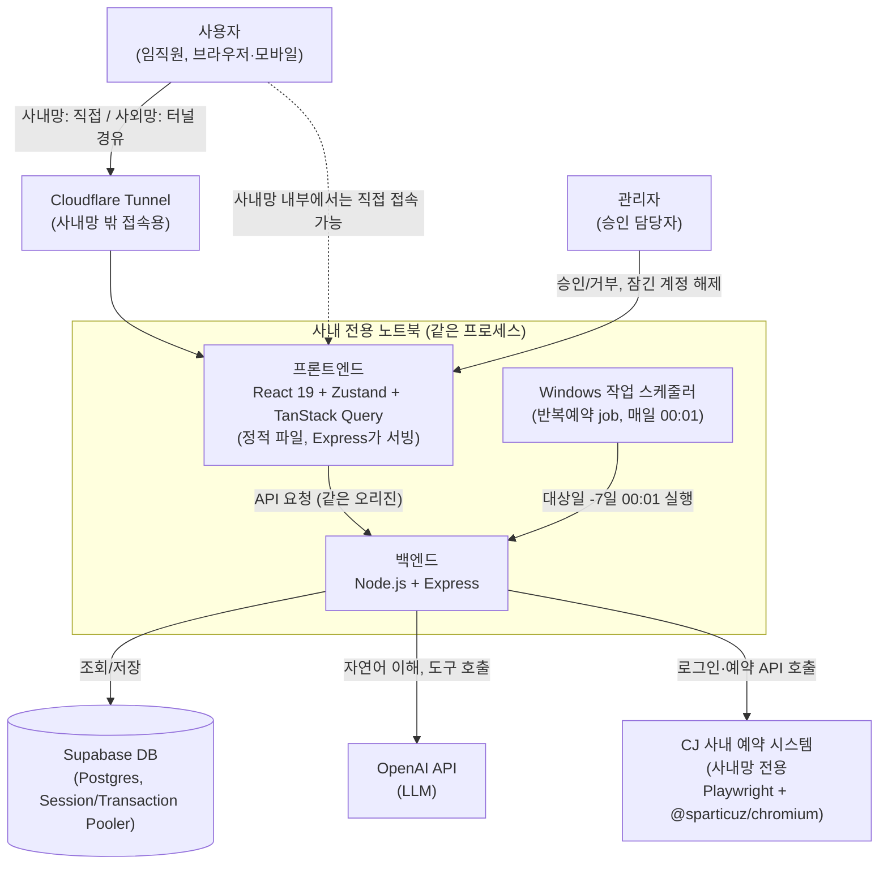
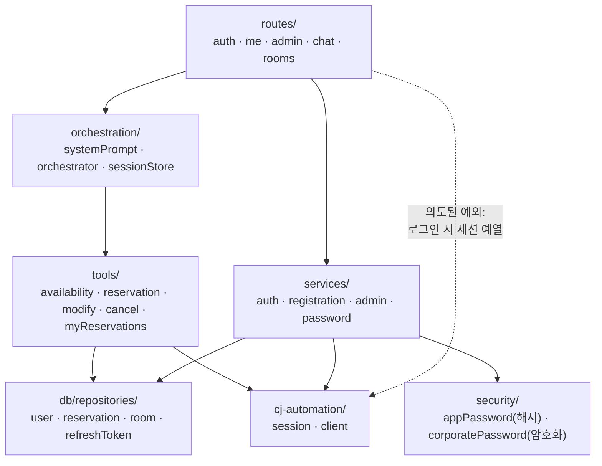
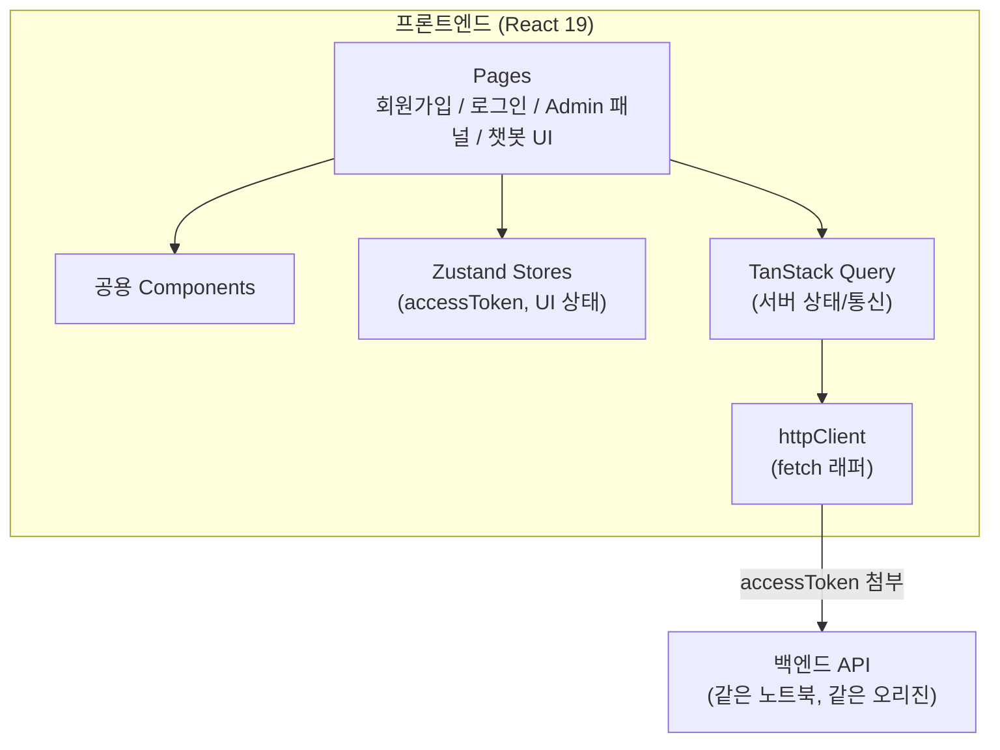

# 기술 아키텍처 다이어그램

CJ 사내 예약 시스템이 사내망 전용이라 사내망 밖에서 접근 불가하므로, 클라우드 배포(Vercel) 대신 **사내 전용 노트북 1대**가 프론트+백엔드를 한 프로세스로 같이 띄우고, DB만 Supabase(외부)를 쓴다. 외부(모바일 등)에서 접속할 때는 Cloudflare Tunnel로 그 노트북에 터널을 뚫는다. 상세 배경: `4-prd.md`, 배포 절차: `laptop-server-setup.md`.

## 백엔드 레이어 구조

`5-project-principle.md` §2의 의존 방향을 그림으로 옮긴 것. **화살표 방향을 거스르는 import는 구조 원칙 위반**이다(예: `cj-automation`이 `orchestration`을 부르는 것).

- `orchestration`은 `tools/`만 부른다 — `pg`나 Playwright를 직접 알지 못한다.
- **`security/`의 두 모듈은 절대 섞이지 않는다**: `corporatePassword`(CJ WORLD PW, 복호화 가능) vs `appPassword`(앱 로그인, 단방향 해시).
- 점선은 `5-project-principle.md` §2에 명시된 **의도된 예외** 두 가지(로그인 시 CJ 세션 예열, 비밀번호 재등록 시 CJ 검증)다.

## 프론트엔드 컴포넌트 구조

