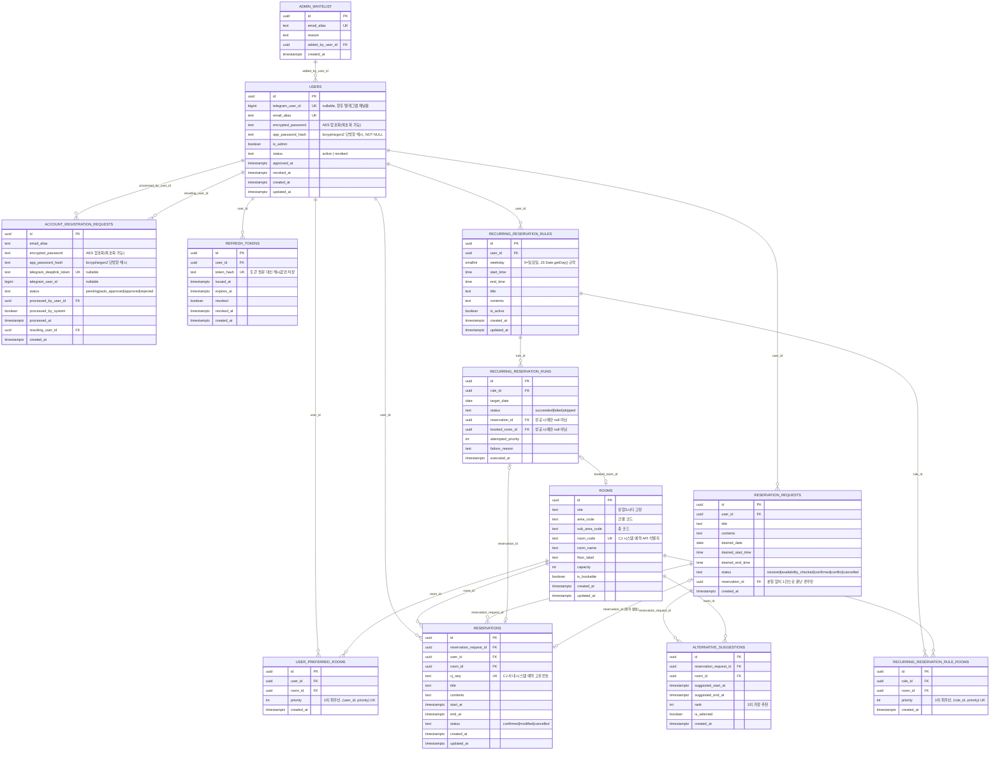

# ERD (Entity Relationship Diagram)

Supabase(Postgres) 마이그레이션(`supabase/migrations/`) 기준 최종 스키마를 반영한 ERD.

## 테이블별 설명

- **admin_whitelist**: 가입 즉시 자동으로 Admin 권한을 받는 CJ WORLD ID 사전 등록 목록(Admin 부트스트랩용).
- **users**: 온보딩 승인을 마친 사용자. CJ WORLD PW(복호화 가능한 암호화)와 앱 자체 로그인 비밀번호(단방향 해시)를 분리해서 저장한다. 두 값 모두 사용자가 나중에 변경할 수 있다(도메인 정의서 2번 "비밀번호 변경" 참고) — 컬럼을 덮어쓰는 방식이라 스키마 변경은 없다.
- **account_registration_requests**: 회원가입 웹페이지에서 제출한 계정 등록 신청 건. 화이트리스트 매칭 시 자동승인, 아니면 Admin 수동 승인/거부 대상.
- **rooms**: 예약 가능한 회의실 목록(상암S시티, 3F/12~16F). CJ 사내 시스템의 area_code/sub_area_code/room_code를 그대로 보관해 예약 API 호출에 사용한다.
- **user_preferred_rooms**: 사용자가 가입 시 등록한 선호 회의실 우선순위 목록(User와 Room의 다대다 관계를 정규화한 테이블).
- **reservation_requests**: 챗봇에 입력된 예약 요청 원본 조건(희망 날짜/시간 등)과 처리 상태.
- **reservations**: 확정된 예약 건. CJ 사내 예약 시스템의 seq(`cj_seq`)를 저장해 변경/취소 API 호출 근거로 사용하며, 동일 회의실·겹치는 시간대 중복 예약은 DB EXCLUDE 제약으로 방지한다.
- **alternative_suggestions**: 요청 시간대가 충돌할 때 제시하는 대체 회의실/시간대 추천 목록.
- **refresh_tokens**: JWT 로그인의 Refresh Token 발급 이력. 토큰 원문이 아니라 해시값만 저장하며, 개별 로그아웃(해당 행 하나 폐기) 또는 비밀번호 변경/보안사고 대응 시 전체 폐기(해당 user_id의 미폐기 행 전체 UPDATE) 두 시나리오 모두 지원한다.
- **chat_sessions** `[20260816 추가]`: 사용자별 챗봇 오케스트레이션 세션(대화 이력 + 확인대기 상태)을 `state jsonb` 하나로 통째로 저장한다. 원래는 `sessionStore.ts`의 in-memory `Map`으로만 관리했는데, Vercel 서버리스에서는 함수 인스턴스가 바뀌면 그 메모리가 통째로 사라져 대화 기억이 유실되는 문제가 있어 DB로 옮겼다. `user_id`가 PK라 사용자당 세션 1개(도메인 정의서 1번: 챗봇 대화 채널이 하나라는 전제)라는 기존 설계를 그대로 반영한다.
- **recurring_reservation_rules** `[신규]`: 사용자가 등록한 반복 예약 규칙. 매주 어느 요일 어느 시간대에 어떤 회의명으로 예약할지 정의한다. `is_active`는 동의 철회 시 자동으로 false로 설정되어 규칙을 비활성화한다.
- **recurring_reservation_rule_rooms** `[신규]`: 각 반복 예약 규칙이 시도할 회의실 목록(1~3순위). **이는 `user_preferred_rooms`(가입 시 등록하는 선호 회의실)과 다른 목적**이다 — 같은 사용자도 규칙마다 다른 회의실 우선순위를 가질 수 있다. `(rule_id, priority)` unique 제약으로 같은 규칙에서 중복된 우선순위를 방지하고, `(rule_id, room_id)` unique 제약으로 같은 회의실이 중복되지 않게 한다.
- **recurring_reservation_runs** `[신규]`: 반복 예약 규칙의 자동 실행 로그 + 멱등성 보장. 매 실행 시마다 대상일, 상태(성공/실패/스킵), 최종 성공한 회의실(있으면), 시도 우선순위 단계, 실패 사유를 기록한다. `(rule_id, target_date)` unique 제약으로 **같은 규칙의 같은 날짜 중복 실행을 방지** — PC 재부팅이나 수동 재실행으로 잡이 같은 날 두 번 돌아도, 잡이 실행 전에 이 행의 존재를 먼저 확인하고 건너뛰므로 **첫 실행 결과가 그대로 남고 CJ에 중복 예약이 생기지 않는다**(나중 실행이 앞의 결과를 덮어쓰지 않는다).
