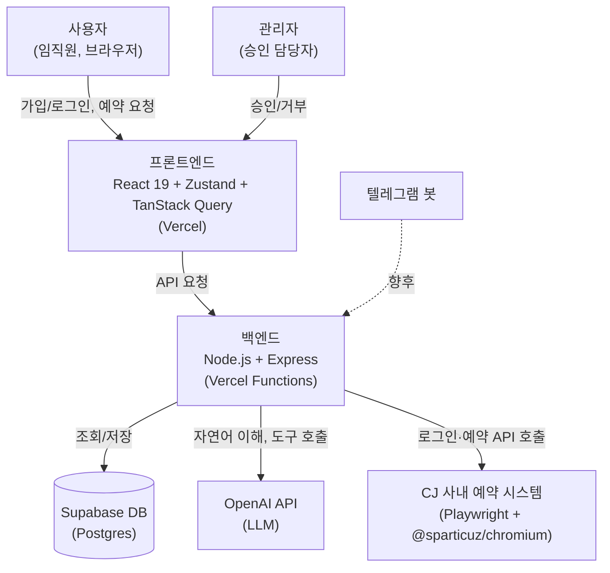
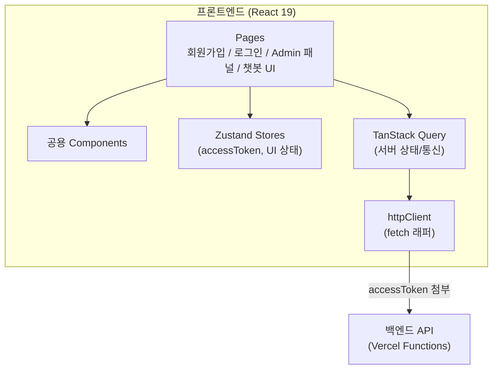

# 기술 아키텍처 다이어그램

```mermaid
flowchart TD
    User["사용자<br/>(임직원, 브라우저)"]
    Admin["관리자<br/>(승인 담당자)"]
    Frontend["프론트엔드<br/>React 19 + Zustand + TanStack Query<br/>(Vercel)"]
    Backend["백엔드<br/>Node.js + Express<br/>(Vercel Functions)"]
    DB[("Supabase DB<br/>(Postgres)")]
    LLM["OpenAI API<br/>(LLM)"]
    CJ["CJ 사내 예약 시스템<br/>(Playwright + @sparticuz/chromium)"]
    Telegram["텔레그램 봇"]

    User -->|"가입/로그인, 예약 요청"| Frontend
    Admin -->|"승인/거부"| Frontend
    Frontend -->|"API 요청"| Backend
    Backend -->|"조회/저장"| DB
    Backend -->|"자연어 이해, 도구 호출"| LLM
    Backend -->|"로그인·예약 API 호출"| CJ
    Telegram -.->|"향후"| Backend
```

## 프론트엔드 컴포넌트 구조

```mermaid
flowchart TD
    subgraph FE["프론트엔드 (React 19)"]
        Pages["Pages<br/>회원가입 / 로그인 / Admin 패널 / 챗봇 UI"]
        Components["공용 Components"]
        Stores["Zustand Stores<br/>(accessToken, UI 상태)"]
        Queries["TanStack Query<br/>(서버 상태/통신)"]
        Http["httpClient<br/>(fetch 래퍼)"]
    end
    BackendAPI["백엔드 API<br/>(Vercel Functions)"]

    Pages --> Components
    Pages --> Stores
    Pages --> Queries
    Queries --> Http
    Http -->|"accessToken 첨부"| BackendAPI
```
