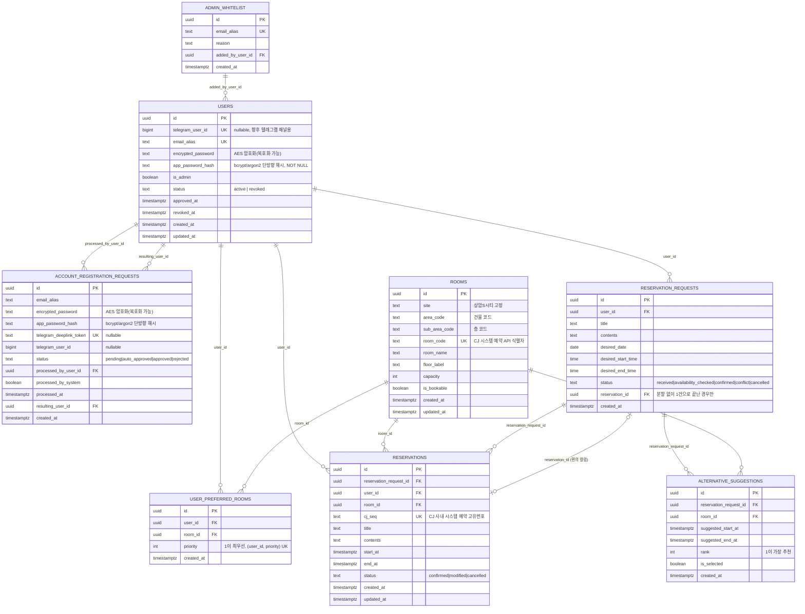

# ERD (Entity Relationship Diagram)

Supabase(Postgres) 마이그레이션(`supabase/migrations/`) 기준 최종 스키마를 반영한 ERD.

## 테이블별 설명

- **admin_whitelist**: 가입 즉시 자동으로 Admin 권한을 받는 사내 계정 ID 사전 등록 목록(Admin 부트스트랩용).
- **users**: 온보딩 승인을 마친 사용자. 사내 계정 비밀번호(복호화 가능한 암호화)와 앱 자체 로그인 비밀번호(단방향 해시)를 분리해서 저장한다.
- **account_registration_requests**: 회원가입 웹페이지에서 제출한 계정 등록 신청 건. 화이트리스트 매칭 시 자동승인, 아니면 Admin 수동 승인/거부 대상.
- **rooms**: 예약 가능한 회의실 목록(상암S시티, 3F/12~16F). CJ 사내 시스템의 area_code/sub_area_code/room_code를 그대로 보관해 예약 API 호출에 사용한다.
- **user_preferred_rooms**: 사용자가 가입 시 등록한 선호 회의실 우선순위 목록(User와 Room의 다대다 관계를 정규화한 테이블).
- **reservation_requests**: 챗봇에 입력된 예약 요청 원본 조건(희망 날짜/시간 등)과 처리 상태.
- **reservations**: 확정된 예약 건. CJ 사내 예약 시스템의 seq(`cj_seq`)를 저장해 변경/취소 API 호출 근거로 사용하며, 동일 회의실·겹치는 시간대 중복 예약은 DB EXCLUDE 제약으로 방지한다.
- **alternative_suggestions**: 요청 시간대가 충돌할 때 제시하는 대체 회의실/시간대 추천 목록.
