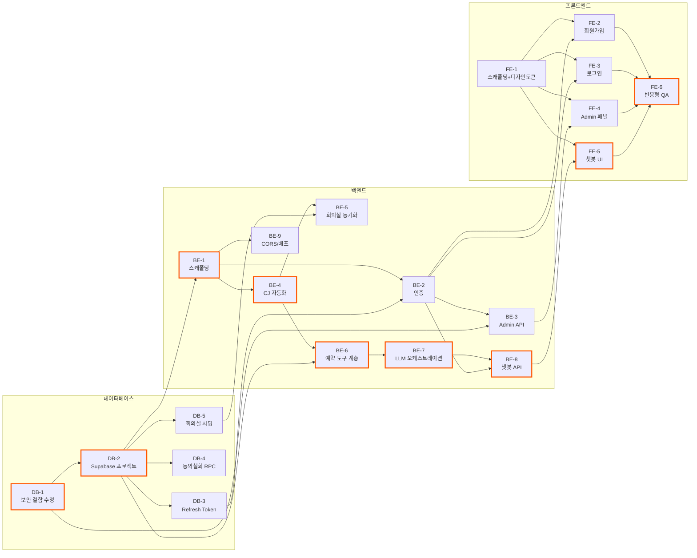

# 실행계획 — 회의실 예약 Agent

`docs/`, `prompts/`, `supabase/`에 정리된 확정 사항(도메인 정의서, PRD, ERD, 프로젝트 구조 원칙, 통합 스키마, 보안 검토 결과)을 근거로 DB/백엔드/프론트엔드 단위 Task로 분해한 실행계획이다. 각 Task는 작업 내용·선행 Task·체크박스형 완료 조건으로 구성된다.

**전체 진행 순서 요약**: `DB-1`(보안 결함 수정)이 다른 모든 인증 관련 작업의 전제 조건이므로 최우선. 그다음 `DB-2`(실제 Supabase 프로젝트 생성)가 백엔드/프론트 개발 착수의 공통 전제. 이후 DB→백엔드→프론트 순으로 대체로 진행되지만, 화면(프론트) 스캐폴딩과 디자인 토큰 반영(`FE-1`)은 백엔드와 병행 가능하다.

## 전체 Task 의존관계

색이 칠해진 노드(진한 테두리)는 크리티컬 패스(가장 긴 연쇄, 전체 일정을 좌우하는 경로)다.

---

## 데이터베이스 (DB)

### DB-1. 보안 결함 긴급 수정 — SECURITY DEFINER 함수 권한 회수 + 화이트리스트 재검증

- **작업 내용**: `security-reviewer` 검토에서 발견된 치명적 결함(anon key로 `approve_account_registration_request` 등을 직접 호출해 Admin 권한을 탈취할 수 있는 문제)을 고치는 새 마이그레이션 파일을 `supabase/migrations/`에 추가한다.
  - `approve_account_registration_request`, `reject_account_registration_request`, `get_user_frequent_rooms` 세 함수에 `revoke execute on function ... from public, anon, authenticated;` 추가
  - `approve_account_registration_request`가 호출자가 넘긴 `p_is_auto`를 그대로 신뢰하지 않고, 함수 내부에서 `admin_whitelist`를 직접 재조회해 `is_admin` 여부를 결정하도록 로직 수정
  - `supabase/8-schema.sql`(통합본)에도 동일하게 반영
- **선행 Task**: 없음 (다른 모든 인증 관련 Task의 선행 조건)
- **완료 조건**:
  - [x] 새 마이그레이션 파일이 `supabase/migrations/`에 타임스탬프 순으로 추가됨 (`20260813001200_fix_admin_escalation.sql`)
  - [x] 세 함수 모두 `REVOKE EXECUTE ... FROM public, anon, authenticated` 적용 확인
  - [x] `approve_account_registration_request`가 `admin_whitelist`를 직접 재조회하도록 수정되고, 호출자 입력값(`p_is_auto`)만으로 Admin이 부여되지 않음을 코드로 확인 (`p_is_auto` 파라미터 자체를 제거, 수동 승인 시 `p_admin_user_id`가 실제 활성 Admin인지도 DB가 검증)
  - [x] `supabase/8-schema.sql`이 이 수정 사항까지 반영해 최신화됨
  - [ ] 로컬/스테이징 Supabase 프로젝트에 적용 후, anon key로 세 함수를 직접 RPC 호출 시 권한 오류로 거부되는지 실제 테스트로 확인 (아직 실제 프로젝트 없음 — DB-2 완료 후 진행)

### DB-2. 실제 Supabase 프로젝트 생성 및 마이그레이션 적용

- **작업 내용**: supabase.com에 프로젝트 생성(Dev/Prd 공용, PRD 결정사항), `supabase/migrations/` 전체를 순서대로 적용, `.env`의 `SUPABASE_URL`/`SUPABASE_SERVICE_ROLE_KEY`/`SUPABASE_ANON_KEY`/`DATABASE_URL`(커넥션 풀러 6543 포트) 채움.
- **선행 Task**: DB-1
- **완료 조건**:
  - [ ] Supabase 프로젝트 생성 완료
  - [ ] `supabase/migrations/` 전체(DB-1 포함)가 순서대로 적용되어 오류 없이 끝까지 실행됨
  - [ ] `.env`의 Supabase/DB 관련 값이 실제 프로젝트 값으로 채워짐 (커넥션 풀러 주소 사용, 5432 직접 연결 아님)
  - [ ] `psql` 또는 Supabase 대시보드에서 8개 테이블이 모두 생성된 것을 확인

### DB-3. Refresh Token 폐기 테이블 추가

- **작업 내용**: PRD "인증/보안" 절에서 결정된 대로, Refresh Token 발급 이력을 저장해 서버가 개별/전체 폐기(revoke)할 수 있는 테이블(`refresh_tokens` 등)을 설계·추가하는 마이그레이션 작성. `security-reviewer` 권고대로 `users.password_changed_at`(또는 동등한 컬럼) 추가도 함께 검토.
- **선행 Task**: DB-2
- **완료 조건**:
  - [x] `refresh_tokens` 테이블(또는 동등 설계)이 마이그레이션으로 추가됨 (`20260813002000_refresh_tokens.sql`) — 최소 컬럼: 토큰 식별자/해시, `user_id` FK, 발급/만료 시각, 폐기 여부·시각. 로컬 개발 DB(`DB-2` 미완료로 클라우드 Supabase 대신 로컬 Postgres 사용 중)에 실제 적용 확인 완료
  - [x] 개별 토큰 폐기(로그아웃)와 사용자 전체 토큰 폐기(비밀번호 변경/보안사고 대응) 두 시나리오 모두 쿼리로 처리 가능한 구조인지 확인 (`(user_id, revoked)` 인덱스, 별도 RPC 불필요)
  - [x] `supabase/8-schema.sql`에도 반영 (`prompts/8-erd.md`도 함께 갱신)

### DB-4. 동의 철회 시 자격증명 즉시 폐기 RPC 추가

- **작업 내용**: 도메인 정의서 8번 "동의 철회 시 즉시 삭제 및 접근 차단" 요구사항을 DB 레벨에서 강제하는 RPC(`revoke_user` 등) 추가. `users.status='revoked'` 전환과 동시에 `encrypted_password`/`app_password_hash`를 원자적으로 비운다.
- **선행 Task**: DB-2
- **완료 조건**:
  - [ ] `revoke_user(user_id)` 형태의 함수가 마이그레이션으로 추가됨
  - [ ] 함수 실행 시 `status='revoked'`, `revoked_at=now()`, `encrypted_password=''`, `app_password_hash=null`이 하나의 트랜잭션으로 처리됨
  - [ ] `check (status <> 'revoked' or revoked_at is not null)` 등 정합성 제약 추가
  - [ ] `supabase/8-schema.sql`에도 반영

### DB-5. 회의실 마스터데이터 시딩

- **작업 내용**: `rooms` 테이블에 상암S시티 3F·12F~16F 실제 회의실 데이터(room_code, area_code, sub_area_code, room_name, floor_label)를 입력. `capacity`는 CJ API의 `room_info.ATTENDER_LIMIT` 파싱 결과로 채우는 것이 원칙이나(도메인 정의서 9번), 최초 시딩은 수동 스크립트로 진행 가능.
- **선행 Task**: DB-2, (capacity 자동 채움은 BE-4·BE-5 완료 후 재실행 권장)
- **완료 조건**:
  - [x] 3F, 12F~16F 각 층의 실제 회의실이 `rooms`에 모두 입력됨 (`backend/scripts/seed-rooms.ts` 실행, 로컬 개발 DB 기준. 실측 결과 3F는 11개(3F-8 없음), 12F 4개, 13F 4개, 14F 4개(14F-1 없음), 15F 2개(15F-4~5만 존재), 16F 1개로 도메인 문서 예시 "3F-1~3F-12"와 실제 회의실 개수가 다름을 확인 — 실사용 조회 결과를 그대로 반영했으며 도메인 정의서 9번에도 반영함)
  - [x] B1F/2F는 데이터에 아예 포함하지 않음 (스캔 대상 층 목록에서 처음부터 제외)
  - [x] 각 회의실의 `room_code`/`area_code`/`sub_area_code`가 실제 CJ 시스템 값과 일치함 (스캔 결과 그대로 upsert, SELECT로 NULL/이상값 없음 확인)
  - [x] `capacity`가 26개 회의실 전부 실제 값(응답 HTML의 `num_person` 파싱, 추정치 아님)으로 채워짐

---

## 백엔드 (Backend)

### BE-1. 백엔드 프로젝트 스캐폴딩

- **작업 내용**: `5-project-principle.md` 7번 구조대로 Node.js + Express + TypeScript 프로젝트 초기화. `orchestration/ tools/ cj-automation/ services/ security/ db/ middleware/ config/` 폴더 생성, `pg` 커넥션 풀(풀러 6543 사용) 연결, `.env` 파싱 모듈(`config/env.ts`) 작성, Vercel Functions 진입점(`api/`) 구성.
- **선행 Task**: DB-2
- **완료 조건**:
  - [x] `5-project-principle.md` 7번의 폴더 구조가 그대로 생성됨
  - [x] `pg` Pool이 `DATABASE_URL`로 연결되고, 로컬에서 간단한 쿼리(`select now()`)가 성공함 (DB-2 미완료로 지금은 커넥션 풀러 6543 대신 로컬 Postgres 5432로 대체 — 나중에 `.env`만 교체하면 됨, 코드에 포트/호스트 가정 없음)
  - [x] `.env`의 시크릿(JWT 두 키, `CREDENTIAL_ENCRYPTION_KEY`, `OPENAI_API_KEY`)이 서로 다른 변수로 분리 로딩됨을 확인
  - [ ] Vercel Functions로 배포했을 때 헬스체크 엔드포인트(`GET /api/health`)가 정상 응답 (아직 미배포 — 로컬 `GET /health` 정상 응답까지만 확인함)

### BE-2. 인증 모듈 (회원가입 / 로그인 / JWT)

- **작업 내용**: `security/corporatePassword.ts`(암호화/복호화), `security/appPassword.ts`(해시/검증), `authService.ts`(JWT 발급·재발급·폐기), `routes/auth.routes.ts`, `routes/registration.routes.ts` 구현. Access Token은 짧은 만료로 응답 바디에, Refresh Token은 httpOnly+Secure+SameSite 쿠키로 발급.
- **선행 Task**: BE-1, DB-3
- **완료 조건**:
  - [x] 회원가입 API가 사내 계정 비밀번호는 암호화, 앱 로그인 비밀번호는 해시로 각각 다른 모듈을 통해 저장함 (두 로직이 물리적으로 다른 파일에 있음)
  - [x] 화이트리스트 매칭 시 자동승인, 아니면 pending으로 접수되는 흐름이 DB-1의 안전한 함수 호출 경로로 동작함
  - [x] 로그인 성공 시 Access Token(응답 바디) + Refresh Token(httpOnly 쿠키) 둘 다 발급됨
  - [x] Access Token 만료 후 재발급 엔드포인트가 Refresh Token으로 정상 동작함
  - [x] 로그아웃 시 DB-3의 폐기 테이블에 해당 Refresh Token이 무효 처리됨
  - [x] 승인 대기/거부/자격증명 오류 각각의 로그인 실패 상태 메시지가 올바르게 구분되어 반환됨 (curl 시나리오 5단계로 로컬 검증 완료)

  **[2026-08-14 FE-2 착수 전 보강]** 회원가입이 `preferred_room_ids`(선호 회의실 우선순위 배열)를 받지 않던 누락을 발견해 채움: 마이그레이션(`20260814000000_registration_preferred_rooms.sql`)으로 `account_registration_requests.preferred_room_ids uuid[]` 추가, `registrationService`/`adminService`가 자동승인·수동승인 양쪽 경로 모두에서 승인 시점에 `user_preferred_rooms`로 옮겨 심도록 구현(`userPreferredRoomRepository.setPreferredRooms`). 공개 `GET /rooms`(+`GET /rooms/:id`) 엔드포인트도 이번에 신규 추가(`routes/rooms.routes.ts`, `docs/swagger.json`에는 이미 명세돼 있었음) — `min_capacity`/`floor_label` 필터만 지원, swagger가 명세한 `date`+`start_time`+`end_time` 실시간 가용성 결합은 **범위 밖으로 명시적으로 보류**(익명 사용자가 어느 CJ 계정으로 조회할지 미결정이라 `date` 파라미터 전달 시 400으로 명확히 거부). curl로 회원가입(pending/auto_approved 양쪽)→`user_preferred_rooms` 우선순위 저장까지 실측 검증 완료.

### BE-3. Admin 승인 API

- **작업 내용**: `routes/admin.routes.ts`, `adminService.ts` — 대기중 등록 요청 목록 조회, 승인/거부 처리(DB-1의 안전한 RPC 호출), Admin 권한 검증 미들웨어(`requireAdmin`).
- **선행 Task**: BE-2, DB-1
- **완료 조건**:
  - [x] `GET /admin/registration-requests`가 pending 목록을 반환 (비밀번호/암호문은 응답에 절대 포함 안 됨)
  - [x] 승인/거부 API가 DB-1에서 수정된 RPC를 정상 호출하고, 결과가 `account_registration_requests`/`users`에 반영됨
  - [x] `is_admin=false`인 사용자의 토큰으로 호출 시 403 반환
  - [x] 승인/거부 후 목록에서 해당 항목이 사라지고 처리 이력에 반영됨 (curl 6단계 시나리오로 로컬 검증 완료)

  **[2026-08-14 FE-4 착수 전 보강]** `GET /admin/registration-requests`가 `status` 쿼리 파라미터를 지원하도록 확장(`docs/swagger.json`에는 이미 명세돼 있었으나 구현이 안 되어 있었음): 생략 시 pending, `status=processed`는 auto_approved/approved/rejected 3종을 처리 시각 최신순으로 묶어 반환(FE-4 "처리 완료 이력", 최근 50건 제한). 응답에 `processed_by_email_alias`(처리자 표시용, 자동승인 시 null → 프론트가 "system"으로 표시)와 `preferred_room_ids`도 추가. curl로 pending/processed/잘못된 status(400) 전부 실측 검증.

### BE-4. CJ 자동화 계층

- **작업 내용**: `cj-automation/session.ts`(Playwright 로그인, 세션 유효성 확인+재로그인), `cj-automation/client.ts`(9번 API 명세의 각 엔드포인트 래퍼), `cj-automation/availabilityParser.ts`(`reserve_all_list` + `event_list` 겹침 판정 알고리즘). Vercel Functions 위에서 `@sparticuz/chromium` 사용.
- **선행 Task**: BE-1
- **완료 조건**:
  - [x] 사내 계정 암호화 자격증명을 복호화해 Playwright로 실제 로그인에 성공함 (이 계층 밖으로 복호화된 비밀번호가 전달되지 않음). 실제 흐름(**2026-08-13 BE-7 라이브 검증 중 재확인해 수정**): `cj.cj.net`(`/PT/login.aspx`, `#txtID`/`#txtPWD`)에서 로그인 → 포털 메인(`23_main.aspx`) 로딩 대기 → **회의실예약 버튼(`button#bntConf`, `onclick="select_menu('EPCT3427','LSB')"`) 클릭**(← `23_service.aspx?CONTENTS_ID=EPCT3427`로 직접 `page.goto`하면 `net::ERR_ABORTED`로 실패함을 재검증. 이 URL은 실서버 페이지가 아니라 클라이언트 사이드 콘텐츠 스왑용) → `cjwappr.cj.net`으로 SSO 핸드셰이크(`/NConf/Anonymity/nconfFilter.aspx`)해 API용 쿠키(`AP`) 획득(클릭 후 1초 내) → 이 쿠키로 순수 HTTP ASMX 호출 가능. 도메인 정의서 §8/§9에 "Azure AD" 오기 정정 및 실제 로그인 흐름 반영 완료
  - [x] `getDayPilotConfReserveList`, `checkRoom`, `checkStraightRoom`, `checkDayCountLimit`, `SaveReserve`, `delReserve`, `getConfReservationInfo`, `bindMyReservation` 전부 래핑됨 (경로 접두사 `NCONF/Common/WebService/` 누락 버그 수정, EUC-KR→UTF-8 인코딩 오판 정정, 서버 응답 이어붙임 현상 방어 로직 추가)
  - [x] 가용성 판단 알고리즘(그리드 AND event_list)이 도메인 정의서 9번에 정리된 실사용 케이스(8/13 스캔 결과)와 동일한 결과를 냄 — fixture 기반 유닛 테스트(vitest 25개) 통과로 검증. **단, 이 fixture는 실측 원본 바이트가 아니라 서술을 재구성한 것이었고, BE-7 라이브 검증에서 실제 CJ 원본 응답 형식(`reserve_all_list`가 파이프 구분 문자열, `event_list.start/end`가 전체 ISO 타임스탬프)과 다르다는 게 뒤늦게 드러나 `tools/availability.tool.ts`에서 파싱 버그를 수정함(BE-7 절 참고) — 알고리즘 자체(`availabilityParser.ts`)는 문제 없었고, CJ 원본→정규화 변환 단계의 버그였음**
  - [x] Vercel Functions 환경(콜드스타트, 300초 제한 이내)에서 로그인+API 호출 1건이 실제로 성공함 → 로컬 환경에서 실제 로그인+`getDayPilotConfReserveList`/`bindMyReservation` 호출 성공으로 대체 검증 (실제 Vercel 배포 테스트는 별도 스코프)

### BE-5. 회의실 마스터데이터 동기화

- **작업 내용**: `getDayPilotConfReserveList` 응답의 `room_info`(`ATTENDER_LIMIT` 등)를 파싱해 `rooms.capacity`를 채우거나 갱신하는 동기화 로직/스크립트 작성.
- **선행 Task**: BE-4, DB-5
- **완료 조건**:
  - [x] 전체 층(3F, 12F~16F) 스캔 후 `rooms.capacity`가 실제 값으로 갱신됨 (`backend/src/services/roomSyncService.ts`의 `syncRoomMasterData(userId)`를 로컬 DB `jiil` 계정으로 실행해 26개 회의실 전부 스캔 확인, `backend/scripts/seed-rooms.ts`는 이 서비스를 호출하는 얇은 CLI 래퍼로 리팩터링)
  - [x] 재실행해도 기존 값과 다를 때만 갱신되는 멱등적 동작 확인 (upsert) — `roomRepository.upsertRoomIfChanged`가 `is distinct from` 조건으로 실제 변경 없으면 UPDATE 자체를 건너뛴다. 실측: 변경 없는 상태에서 연속 재실행 시 "0개 변경"·`updated_at` 불변 확인, 의도적으로 한 방(`room_code=4539`)의 `capacity`를 999로 변조 후 재실행하니 그 방만 "1개 변경"으로 감지되어 실제 값(8)으로 복구되고 다른 25개 방의 `updated_at`은 그대로였음을 확인

### BE-6. 예약 도구(tools) 계층

- **작업 내용**: `tools/availability.tool.ts`(가용성 조회+선호회의실 우선순위+조건검색+이력기반추천), `tools/reservation.tool.ts`(예약 생성, 긴 회의 분할+보상 트랜잭션 포함), `tools/modifyReservation.tool.ts`, `tools/cancelReservation.tool.ts`, `tools/myReservations.tool.ts`. `checkRoom → checkStraightRoom → checkDayCountLimit → SaveReserve` 순서 강제.
- **선행 Task**: BE-4, DB-2
- **완료 조건**:
  - [x] 도메인 정의서 2번의 9개 유스케이스(해피패스/조건검색/이력추천/긴회의분할/내예약조회/변경/취소/온보딩 제외)가 각각 함수로 구현됨 (`backend/src/tools/` — `availability.tool.ts`, `reservation.tool.ts`, `modifyReservation.tool.ts`, `cancelReservation.tool.ts`, `myReservations.tool.ts`)
  - [x] 2시간 초과 요청 시 세그먼트 분할(30분 단위, ceil(분/120)) 유닛 테스트 통과 — 분할 규칙은 "앞쪽 세그먼트부터 최대 120분씩 채우고 남는 시간을 마지막에 배정"으로 확정(도메인 정의서 2번 문구도 동일하게 수정: 3시간=180분→120+60분). `npx vitest run` 56개 전부 통과
  - [x] 분할 예약 중 일부 실패 시 이미 생성된 예약이 `delReserve`로 자동 취소되는 보상 트랜잭션 테스트 통과 (`reservation.tool.test.ts`, CJ 저장 실패/DB 저장 실패 두 케이스 모두 검증)
  - [x] 예약 변경/취소는 대상이 모호할 때(여러 건) 바로 진행하지 않고 명확한 오류/안내를 반환함 (`reservationTargeting.ts`의 `AmbiguousReservationTargetError`, 분할그룹 취소 범위 미지정 시 `SplitGroupCancelScopeRequiredError`)
  - [x] `reservations_no_overlap` EXCLUDE 제약 위반 시 서버가 이를 "이미 예약됨" 사용자 메시지로 정상 변환함 (`reservationRepository.ts`, SQLSTATE `23P01` → `RoomAlreadyBookedError`)

  **후속 확인 필요 사항** (실사용 전 CJ 실제 API 응답으로 재검증 필요, 코드 주석에도 남김):
  - `checkRoom`/`checkStraightRoom`/`checkDayCountLimit`/`SaveReserve`의 실제 성공/실패 응답 스키마가 미확인이라 보수적으로 해석하는 헬퍼로 구현함 — **[20260814, FE-5 실사용 검증에서 재확인·정정]** 이 "보수적 해석"이 실제로는 Result 판정 극성이 반대였던 버그였음이 드러남(`checkRoom` 등은 `Result:"0"`=통과, `Result:"1"`=차단인데 반대로 구현되어 있었음 + `.d` 이중디코딩 누락으로 사실상 항상 통과 처리됨). 두 버그 모두 수정 완료, `SaveReserve` 자체는 여전히 원인 미해결 — 상세는 FE-5 섹션 참고.
  - 예약 변경은 "delReserve 후 SaveReserve 재생성" 전략으로 구현(도메인 정의서 8번에 명시된 미확인 사항). 분할 예약(긴 회의) 건의 변경은 이번 범위에서 미지원으로 명시적으로 막음(취소는 지원)
  - `SaveReserve`에 필요한 `phoneNum`은 현재 `users` 테이블에 저장 컬럼이 없어 호출자가 매번 넘기는 파라미터로 처리 — DB 컬럼 추가 필요 여부는 추후 검토

### BE-7. LLM 오케스트레이션 계층

- **작업 내용**: `orchestration/systemPrompt.ts`(비즈니스 규칙 + "요청 처리 가능 여부 판단" 원칙 반영), `orchestration/toolSchemas.ts`(OpenAI tool-calling 스키마), `orchestration/orchestrator.ts`(대화 루프, 세션 상태 관리). 모델은 `OPENAI_MODEL` 환경변수(`gpt-5-nano` 기본).
- **선행 Task**: BE-6
- **완료 조건**:
  - [x] 시스템 프롬프트에 운영시간/2시간 제한/7일 범위/상암S시티 고정/반복예약 미지원 등이 명시됨 (`orchestration/systemPrompt.ts`, `systemPrompt.test.ts`로 문구 존재 검증)
  - [x] "요청 처리 가능 여부 판단" 원칙이 프롬프트 최상위(0번 섹션)에 반영되어, 범위 밖 요청에 임의 실행을 시도하지 않고 안내/되묻기로 응답함 — 실제 OpenAI API로 "매주 월요일 반복 예약해줘" 시나리오를 라이브 검증: 도구를 전혀 호출하지 않고 미지원 안내 후 대안(단일 예약)을 되물음
  - [x] LLM이 BE-6의 도구만 호출하고 CJ 시스템/DB에 직접 접근하지 않음 — `orchestrator.ts`가 `../tools/*`만 import(코드 검토로 확인), `db/*`·`cj-automation/*` import 없음
  - [x] 예약 확정(SaveReserve) 직전 사용자 명시적 확인 없이는 실행되지 않음 — `propose_*`(부작용 없음, confirmationToken 발급) / `confirm_*`(직전 턴 토큰만 실행) 2단계로 코드 레벨 강제, 같은 턴 confirm은 구조적으로 거부. 실제 OpenAI API 라이브 테스트로 `propose_create_reservation`이 실제 토큰을 발급하고 "네, 진행합니다" 같은 명시적 재확인 없이는 멈추는 것까지 확인(confirm은 실제 CJ 예약이 생기므로 의도적으로 실행하지 않음)
  - [x] 세션 상태(진행 중인 예약 등)가 대화록 텍스트가 아니라 서버 상태로 관리됨 (`orchestration/sessionStore.ts`의 `pendingConfirmation`/`turnIndex`, `sessionStore.test.ts`)

  **BE-7 검증 중 발견해 함께 고친 버그** (BE-4/BE-6 범위지만 BE-7 라이브 테스트로만 드러남):
  - `cj-automation/session.ts`: `23_service.aspx?CONTENTS_ID=EPCT3427`로 직접 `page.goto`하면 `net::ERR_ABORTED`로 실패함을 재검증 — 포털 메인(`23_main.aspx`) 로딩 후 회의실예약 버튼(`#bntConf`) 클릭 방식으로 수정(파일 상단 주석에 상세 기록)

  **[2026-08-14, FE-5 실사용 피드백 반영]** 사용자가 실제 채팅을 써보고 4가지를 지적함:
  1. "응답이 너무 장황하다" — `systemPrompt.ts` §5 "응답 스타일"을 대폭 강화: 전체 답변 1~3문장 제한, check_availability/propose_* 결과를 텍스트로 다시 나열 금지(카드가 이미 보여주므로), confirmationToken 노출 금지, 재시도 시 이전 내용 반복 설명 금지 등 구체적 규칙 추가.
  2. "속도가 여전히 느리다" — "매 요청마다 CJ 재로그인" 아키텍처 자체의 비용이라 프롬프트 튜닝으로 해결되지 않음. 세션 캐싱 도입은 위험도 있는 아키텍처 결정이라 처음엔 보류했으나, 사용자가 "로그인 시점에 CJ까지 로그인해두고, 그동안 사용자에게 알려주자"는 구체적 방향을 지시해서 그대로 구현함:
     - `cj-automation/sessionCache.ts` 신규 — userId별 CJ 세션을 짧은 TTL(2분, 관찰된 "수 분" 수명보다 보수적으로 짧게)로 메모리에 캐싱. `session.ts`의 `getValidSession`이 이 캐시를 우선 확인하도록 수정.
     - `POST /auth/login`이 JWT 발급 전에 `getValidSession`을 먼저 호출해 CJ 세션을 예열·캐싱함(최대 45초 타임아웃, 실패해도 로그인 자체는 계속 진행 — CJ 예열은 최적화일 뿐 필수 조건이 아님). `POST /auth/logout`은 캐시를 비움.
     - 프론트 `LoginPage.tsx`에 로그인 처리 중(`loginMutation.isPending`) "회의실 예약 시스템에 연결하는 중이에요" 안내 배너 추가 — 로그인 자체가 느려진 이유를 사용자에게 알려주기 위함.
     - **알려진 한계** (코드 주석에도 남김): (1) 메모리 캐시라 나중에 Vercel Functions(서버리스)로 배포하면 프로세스가 요청마다 달라질 수 있어 캐시가 사실상 안 먹힐 수 있음(DB-2 이후 재검증 필요, 그때 Redis 등 외부 캐시로 교체 검토). (2) TTL 안에서도 CJ가 실제로 세션을 먼저 끊을 수 있는데, 이 경우 자동 무효화/재시도는 아직 구현 안 됨 — 실패하면 사용자가 다시 시도해서 TTL 만료를 기다리거나 서버 재시작이 필요할 수 있음(범위 밖, 다음 세션 검토 대상). (3) 로그인 시점에 CJ 로그인을 미리 하므로, 로그인은 하지만 채팅은 안 쓰는 사용자(예: Admin)도 매번 이 지연을 그대로 겪음 — 트레이드오프로 감수하기로 함.
     - `chat.routes.ts`의 타임아웃 헬퍼를 `backend/src/lib/withTimeout.ts`로 공용화(로그인 예열도 같은 패턴이 필요해서).
  3. "다른 회의실 제안이 이전과 동일하다" — 실제로는 카드 없이 텍스트로만 답하며 이전 턴 정보를 재활용하고 있었음(check_availability를 다시 호출 안 함). `systemPrompt.ts`에 §3-7 신설: "다른 곳 보여줘" 류 요청에는 반드시 check_availability를 재호출해 새 카드로 응답하도록 명시.
  4. "선호 회의실을 가입 후에도 채팅에서 추가/제거할 수 있어야 한다" — 신규 기능 추가: `db/repositories/userPreferredRoomRepository.ts`에 `addPreferredRoom`/`removePreferredRoomByRoomId`(삭제 후 우선순위 1..N 재정렬, 음수 경유 2단계 UPDATE로 unique 제약 충돌 방지), `tools/preferredRooms.tool.ts` 신규(회의실명으로 조회 후 추가/제거), `orchestrator.ts`/`toolSchemas.ts`에 `add_preferred_room`/`remove_preferred_room` 도구 추가(CJ 쓰기가 아니라 되돌리기 쉬운 로컬 설정이라 propose/confirm 2단계 생략, 즉시 실행). 프론트는 이 두 도구 실행 후 사이드바 "선호 회의실"을 자동 재조회하도록 `ChatPage.tsx`에 연결. `AdminPanelPage.tsx`/`ChatPage.tsx`에는 서로 오가는 네비게이션 버튼도 추가(세션이 메모리에만 있어 풀 페이지 이동 시 로그아웃되는 문제 — react-router `Link`로 클라이언트 사이드 이동하게 함).

  **[2026-08-14, 실제 대화록 리뷰로 발견 — 세션 히스토리 트리밍 버그, 심각도 높음]** 사용자가 공유한 실사용 대화록에서 평범한 잡담("배고파"/"졸려")에 "메시지 처리 중 오류가 발생했습니다"가 뜬 걸 보고 `.dev-server.log`를 뒤져 실제 원인을 찾음: `sessionStore.ts`의 `appendMessage`가 히스토리 상한(20개)을 넘으면 오래된 메시지부터 개수 기준으로만 잘라냈는데, 자름 지점이 "assistant(tool_calls) + 그 tool 응답들" 묶음 한가운데 걸리면 **tool 응답만 배열 맨 앞에 고아로 남아** OpenAI가 `messages with role 'tool' must be a response to a preceeding message with 'tool_calls'`로 그 요청을 거부했다(대화가 길어질 때마다 반복 재현됨, 상한을 넘기는 새 메시지가 쌓일 때마다 계속 실패하다가 나중에 그 고아 메시지 자체가 밀려나야 정상화됨). `appendMessage`를 "자름 지점이 tool 메시지를 가리키면 그 다음 non-tool 메시지까지 통째로 건너뛴다"로 수정하고, `sessionStore.test.ts`에 정확히 이 시나리오(3개씩 묶인 assistant+tool×2 그룹을 반복 추가)를 재현하는 회귀 테스트 추가 — 수정 전 코드로는 이 테스트가 실패함을 확인.

  **[2026-08-14, 같은 대화록에서 발견 — UX 개선]** 예약에 필요한 정보(회의명/내용/인원)를 title→content→인원 순으로 턴마다 따로따로 캐물어서 사용자가 "인원수, 제목, 내용만 있으면 되는데 왜 이렇게 여러 번 물어보냐"고 지적함(전화번호까지 매번 물어봄). `systemPrompt.ts`에 §3-4b 신설 + `toolSchemas.ts`의 `contents`/`phoneNum` 설명 보강: (1) 부족한 정보는 한 번에 몰아서 질문, (2) 전화번호는 사용자가 먼저 안 주면 절대 먼저 묻지 않고 빈 문자열로 처리, (3) content를 따로 안 주면 title을 그대로 재사용(캐묻지 않음).

  **[2026-08-14, 같은 대화록에서 발견 — 날짜 암산 오류]** "다음주 목요일"(오늘부터 6일 뒤, 범위 안)을 모델이 스스로 "7일 범위를 벗어났다"고 잘못 판단해 거절했다가 사용자 정정 후에야 바로잡음 — `assertValidReservationWindow`(백엔드 검증)는 정상이라 순수 모델 암산 실수였음. `systemPrompt.ts` §2에 오늘 날짜의 요일을 서버가 직접 계산해서 함께 주입(`todayWeekdayKo`)하고, "암산에 자신 없으면 스스로 거절하지 말고 일단 도구를 호출해 서버 판정에 맡기라"는 지침 추가.

  **[2026-08-14, 챗봇 카드 UI 리디자인]** 사용자가 외부 디자인 제안 문서(`frontend/design_recom/README.md` + `meeting-room-chat-ui.dc.html`, Claude가 생성)를 근거로 카드 UI 개선을 요청. `.dc.html`은 프로토타입 전용 포맷이라 그대로 이식하지 않고, README 지침대로 이 프로젝트의 기존 `DESIGN.md`/`tokens.css` 토큰에 맞춰 시각적 결과만 재구현함. AskUserQuestion으로 범위를 백엔드가 이미 지원하는 4개 시나리오로 한정(원안 6개 중 "취소완료·되돌리기"는 취소 되돌리기 API가 없어서, "대안제시"는 대안 시간/축소 인원 탐색 로직이 없어서 제외):
  1. **추천 우선형** — `check_availability`(선호 회의실 있을 때)와 `propose_create_reservation`이 공용으로 쓰는 `RoomRecommendationCard`: 큰 카드 하나(회의실명 + "추천" 배지 + 날짜/시간 + 정원/비고 태그) + 하단 "다른 후보 N곳" 칩 목록.
  2. **전체 가용 목록** — `check_availability`가 선호 회의실이 없을 때(`preferred.length === 0`) 쓰는 `FloorGroupedRoomsCard`: 층별로 묶은 칩 목록에서 하나를 고르면 하단 확정 바가 활성화.
  3. **내 예약 조회 리스트** — 신규 `case "get_my_reservations"`(이전엔 카드 없이 텍스트로만 응답했음) → `MyReservationsListCard`: 헤더(건수) + 세그먼트별 행(색 레일로 "다음 일정" 강조, 종료 항목은 흐리게) + 하단 "시간 변경"/"예약 취소" 액션 바.
  4. **취소/변경 대상 되묻기** — 신규 `case "find_reservation_candidates"`(`status === "ambiguous"`일 때, 이전엔 카드 없음) → `ReservationPickerCard`: 라디오 형태 후보 목록 + 하단 "선택" 버튼. 원안은 이 카드에서 바로 danger 톤 "취소하기"를 눌렀지만, 이 프로젝트는 대상 특정과 실제 취소/변경 확정이 별도 도구 호출(2단계 확인)이라 여기서는 파괴적 행동이 아직 아님 — danger 톤은 대상이 특정된 뒤 뜨는 `propose_cancel_reservation` 확인 카드로 옮기고(버튼을 `variant="danger"`, 라벨 "취소하기"로 변경), 이 카드는 중립 톤 유지.
  - 새 공용 컴포넌트: `Button`에 `variant="danger"`(되돌리기 어려운 행동 전용, `semantic-error` 톤), `Badge`에 `tone="warn"`(앰버, "추천" 배지용) 추가. "다음 일정" 배지는 이 카드에만 쓰는 좁은 용도라 공용 `Badge`를 확장하지 않고 `ChatPage.css`에 `--fin-orange` 기반 로컬 클래스로 처리.
  - 백엔드는 `check_availability` 도구 결과에 `date`/`startTime`/`endTime`을 추가해 프론트가 reply 텍스트를 파싱하지 않고 카드에 바로 바인딩하게 함(`propose_create_reservation`과 동일 패턴).
  - `frontend/src/types/chat.ts`에 `GetMyReservationsData`/`ReservationCandidate`/`FindReservationCandidatesData` 신규.
  - 검증: 프론트 `tsc --noEmit` + `npm run build` 통과(빌드 산출물 정상). Playwright MCP 연결이 이 세션 중간부터 끊겨 브라우저 실측은 못 함 — 사용자에게 실제 브라우저 확인 요청 필요.

  **[2026-08-14, 재차 실사용 피드백 — 회의 제목 안 물어봄 + 같은 질문 중복 표시]** 사용자가 새 대화록을 공유: "다음주 월요일 오전 9시 1시간, 4명" 요청에 인원수만 한 번 물은 뒤(그마저 같은 문장이 줄바꿈으로 두 번 표시됨) 회의실을 고르자마자 title 없이 바로 propose_create_reservation을 호출함.
  - **title 미수집 원인**: `systemPrompt.ts` §3-4b가 "필요한 정보를 한 번에 몰아서 물어라"고만 지시했을 뿐, "check_availability에 필요한 인원수만 물으면 title은 생략해도 된다"는 오판을 막는 명시적 방지 문구가 없었음 — 모델이 인원수 질문 하나로 "필요한 정보 다 물었다"고 잘못 판단해 title 없이(또는 지어내서) propose를 호출한 것으로 추정. §3-4b에 "title은 반드시 사용자에게 실제로 물어 받은 값만 쓰고, 지어내거나 placeholder를 채우지 마라. check_availability로 회의실을 이미 보여줬어도 title을 못 받았으면 propose 호출 전에 반드시 먼저 물어라" 문구 추가.
  - **중복 문장 표시 원인**: `handleUserMessage`는 도구 호출 없는 최종 응답을 `assistantMessage.content` 그대로 한 번만 `finalReply`로 쓰므로(오케스트레이션 루프 자체가 텍스트를 중복 조립하지 않음), 모델이 자기 응답 안에서 같은 문장을 줄바꿈으로 두 번 낸 것 — LLM 쪽 반복 아티팩트. `systemPrompt.ts` §5에 "같은 질문/문장을 줄바꿈으로 두 번 반복하지 마라" 문구 추가 + `orchestrator.ts`에 `collapseDuplicateLines()` 방어 로직 신설(최종 응답에서 연속으로 붙은 동일한 줄을 하나로 합침, 프롬프트만으로는 100% 막을 수 없는 LLM 반복 실패 모드에 대한 안전망).
  - 검증: 백엔드 `tsc --noEmit` + `vitest run`(94/94) 통과. 프롬프트 튜닝의 효과는 실제 대화로 재현해봐야 확인되는데, Playwright가 끊겨 있어 이번 세션엔 실측 못 함 — 다음 실사용 때 재확인 필요.

  (예약 확정 마지막 단계에서 "CJ 시스템에서 거부됐어요"가 뜨는 건 위에서 이미 추적 중인 SaveReserve Result:0 미해결 이슈와 동일 — 새 버그 아님. 이번 대화록에서도 동일 증상(13F-4, 2026-08-17 09:00~10:00)이 재현됨. 다음 세션에서 이전에 정리한 우선순위(Playwright 네트워크 캡처로 실제 성공 요청과 diff)로 계속 조사할 것.)

  **[2026-08-14, "실제로 예약/취소가 되도록 고쳐라" — SaveReserve Result:0 재조사, 실질적 진전 + 새 미해결 발견]** 사용자가 명확히 요구해서 SaveReserve 실패를 다시 파고듦. `reserve_insmod.js`를 재확보해 `getReservationInfo()`/`getRoomOptionInfo()`를 다시 읽어보니, **실제 CJ 웹 UI는 신규 예약 폼을 열 때마다 `getEmptyRoomInfo`를 먼저 호출해서 그 회의실의 `REQUIRED_APPROVAL`(gubun)/`PRE_MAIL_ALARM_YN`(is_send_alarm)/승인자 목록(Table3 → admin_alias/admin_lang)을 동적으로 가져와 SaveReserve에 그대로 실어 보낸다는 게 확인됐다 — 우리는 이 호출 자체를 아예 안 하고 gubun=0/isSendAlarm="False"/adminAlias=""/adminLang=""을 항상 고정값으로 보내고 있었다.**
  - **고침**: `client.ts`에 `GetEmptyRoomInfoResponse` 타입 추가(`.d`가 `"nodata"` 문자열로 오는 경우까지 포함). `reservation.tool.ts`에 `fetchRoomOptionInfo()`(+ `extractRoomOptionInfo()`) 신설 — `saveOneSegmentToCj`가 SaveReserve 호출 직전에 이 회의실+시간대 기준으로 `getEmptyRoomInfo`를 실제로 호출해서 gubun/isSendAlarm/adminAlias/adminLang을 동적으로 채운다(admin_alias/admin_lang은 실제 UI와 동일하게 각 항목 뒤에 `;`를 붙여 이어붙임). 조회 자체가 실패해도(네트워크 오류 등) 예약 시도를 막지 않고 fallback(gubun=0)으로 계속 진행한다. `modifyReservation.tool.ts`의 두 SaveReserve 호출부(신규 저장 + 실패 시 원래 회의실 복구)도 동일한 헬퍼(`fetchRoomOptionInfo` 재사용, `saveReserveChecked()`로 통합)로 맞추고, 원래 빠져있던 SaveReserve `Result` 필드 명시적 확인도 여기에 처음 추가함(기존엔 `extractSeq`가 우연히 뭔가 뽑아내면 성공으로 오판할 여지가 있었음). `reservation.tool.test.ts`에 회귀 테스트 3개 추가(승인불필요/승인필요+승인자/조회실패 시 fallback).
  - **실사용 재검증 결과 — 아직 미해결, 그러나 새로운 단서 확보**: jiil 실 계정으로 `getEmptyRoomInfo`를 실제 호출해보니, **샘플로 조회한 회의실(3F-6, 3F-1) 전부 `REQUIRED_APPROVAL: "1"`(승인 필요)로 나오는데 승인자 목록(Table3)은 비어있었고, 심지어 신청자 본인 정보(Table2, 휴대폰번호)까지 비어있었다** — `AVAILABLE_TIME`도 전부 "0" 뿐인 이상한 값. 이 상태로 SaveReserve를 호출하면(gubun=1, admin_alias="") 여전히 `{"Result":0,"MailResult":0,"Seq":null}`로 거부됨을 재확인했다. 즉 우리 요청 필드 자체는 이제 실제 UI와 동일한 값을 실어 보내고 있는데도 서버가 거부하고 있어서, **문제가 우리 페이로드가 아니라 (a) 이 계정/회의실 조합에 대한 CJ 서버 쪽 데이터(승인자 미배정 등) 문제이거나, (b) getEmptyRoomInfo 자체가 이 세션/계정에 대해 정상적으로 데이터를 못 찾고 있는(그래서 본인 정보까지 비는) 상황일 가능성이 높다.**
  - Playwright로 실제 브라우저에서 `reserve_main.aspx`의 진짜 더블클릭 흐름을 그대로 재현(`modalFrame()` 직접 호출)해서 실제 성공 요청을 네트워크 캡처로 확보하려 시도했으나, 모달 iframe(`#popupFrame`)이 DOM에 아직 안 만들어진 상태라 실패함(초기 로드 후 몇 초 대기로는 부족한 것으로 보임 — 정확한 초기화 완료 시점을 못 찾음). 이 접근은 여기서 중단.
  - **다음 세션 우선순위(가장 빠르고 확실한 다음 한 걸음)**: jiil 본인이 실제 CJ 웹 브라우저(`https://cjwappr.cj.net/NConf/conferenceRoom/reserve_main.aspx`)에서 3F-1이나 3F-6 같은 평범한 회의실을 **직접 클릭해서 예약을 시도**해보고 성공하는지 확인. (1) 실제 UI에서도 안 되면 → CJ 서버/계정 쪽 데이터 문제(승인자 미배정 등)로 확정, CJ IT 담당자에게 문의해야 하는 범위. (2) 실제 UI에서는 되면 → 우리 getEmptyRoomInfo 호출 자체가 이 계정에 대해 실패하고 있다는 뜻이므로, 세션 쿠키(브라우저 로그인 vs 우리 세션 확보 방식의 차이) 쪽을 다시 파야 함. 이 결과에 따라 다음 조사 방향이 완전히 갈리므로, 이 확인이 안 되면 더 파도 헛수고일 수 있다.
  - 검증: 백엔드 `tsc --noEmit` + `vitest run`(97/97) 통과. 진단용으로 만든 임시 스크립트(`backend/scripts/tmp-*.ts`)와 `reserve_insmod.js`/`confReserve_main.js`/`reserveCommon.js` 원본은 확인 후 전부 삭제함(리포에 남기지 않음).

  **[2026-08-14, 같은 날 — SaveReserve Result:0 최종 해결]** 사용자가 바로 위 "다음 세션 우선순위"를 그 자리에서 실행함 — 실제 CJ 웹 브라우저로 3F-4를 2026-08-15 10:00~10:30에 직접 예약해서 **성공**시켰다(스크린샷으로 "저장되었습니다" + 예약 조회 화면까지 확인). 이 결과로 "실제 UI에서는 된다"가 확정됐고, 곧바로 우리 세션 확보 방식을 다시 팠다:
  - 방금 성공한 것과 **같은 회의실(3F-4)**, 다른 시간대로 우리 `createReservation` 경로를 그대로 실행해봤는데도 **여전히 Result:0** — 즉 회의실 자체의 문제가 전혀 아니었다.
  - `getEmptyRoomInfo`의 원본 응답을 다시 찍어보니 `Table2`(신청자 본인 연락처)와 `Table3`(승인자 목록)이 **항상 빈 배열**로 왔다. 실제 UI가 예약 폼에 jiil의 휴대폰번호(010-2065-0528)를 자동으로 채워 넣는 걸 스크린샷으로 이미 봤는데 우리 쪽에서는 그 정보 자체를 못 가져오고 있었다는 뜻 — **필드 값이 아니라 "이 세션이 누구인지"를 서버가 못 찾고 있다는 신호**로 재해석했다.
  - 가설: cjwappr.cj.net의 예약 관련 ASMX들은 쿠키만으로 신청자를 못 찾는 **레거시 ASP.NET WebForms 서버측 Session 상태**에 의존하고, 이 Session은 로그인 직후 `#bntConf` 클릭만으로는 안 채워지며 **실제 예약 폼 페이지(`reserve_insmod.aspx`)를 최소 한 번 방문**해야(그 페이지의 Page_Load에서 채워지는 것으로 추정) 채워진다.
  - Playwright로 검증: 로그인 → `#bntConf` 클릭 직후 바로 `getEmptyRoomInfo`를 호출하면 Table2/Table3이 비어있고 SaveReserve는 Result:0. 그 상태에서 `reserve_insmod.aspx`를 **한 번**(회의실 코드를 비워도 무방 — 특정 회의실과 무관하게 작동함을 확인, 이 페이지는 파라미터가 이상해도 보통 `ErrorPage.aspx`로 리다이렉트되는데 그래도 상관없이 워밍업 효과는 남는다) 방문한 뒤 같은 세션으로 다시 `getEmptyRoomInfo`를 호출하면 Table2/Table3이 정상적으로 채워지고, 이어서 여러 다른 회의실(3F-4, 3F-9)에 대해 `checkRoom → checkStraightRoom → checkDayCountLimit → SaveReserve`가 전부 정상 통과 + **`Result:1`(성공)** 로 예약이 실제로 생성됨을 반복 재현했다(생성 직후 `delReserve`로 즉시 취소해 흔적을 안 남김).
  - **부수적으로 확인된 것**: `gubun`/`admin_alias` 등 필드 값 자체는 SaveReserve 성공/실패에 실질적 영향이 없었다(워밍업 안 된 세션에서는 어떤 값을 넣어도 실패했고, 워밍업된 세션에서는 `gubun=1`+`adminAlias=""` 같은 "틀린" 조합으로도 성공했다) — 즉 이전 세션에서 고친 "getEmptyRoomInfo로 gubun/admin 필드를 동적으로 채우는" 수정은 **실제 성공/실패의 원인이 아니었다**(실사용 승인 라우팅 정확도를 위해서는 여전히 유효한 개선이라 그대로 유지). 진짜 원인은 처음부터 세션 워밍업 누락이었다.
  - **고침**: `cj-automation/session.ts`의 `loginWithCredentials`에 `warmUpReservationSession()` 신설 — `#bntConf` 클릭 후 AP 쿠키 확보 직후, `reserve_main.aspx` 프레임을 찾아(첫 폴링 시도에 아직 없을 수 있어 최대 5초 폴링) `reserve_insmod.aspx`를 회의실 미지정(`room_code=`, `start_time=`, `end_time=` 빈 값)으로 한 번 방문시킨다. `area_code`/`sub_area_code`는 이 프로젝트가 유일하게 지원하는 상암S시티/3F 조합(`804`/`1128`, 도메인 정의서에 이미 등장하는 상수)을 그대로 씀 — 실제 예약 대상 회의실과 무관하게 세션 상태만 채우는 용도라 특정 회의실코드가 필요 없다. 이 워밍업이 실패해도(타임아웃 등) 로그인 자체는 막지 않는다(그러면 이후 SaveReserve가 Result:0으로 알려주는 기존 동작으로 자연스럽게 대체됨).
  - **최종 검증**: 세션 캐시를 비우고 실제 프로덕션 코드 경로(`createReservation` → `getValidSession` → 새 워밍업 포함 로그인)로 3F-12를 2026-08-15 16:00~16:30에 실제로 예약 → **성공**(`Result:1`, 실제 CJ Seq 발급 확인) → 즉시 `delReserve`로 정리. 백엔드 `tsc --noEmit` + `vitest run`(97/97) 통과. 진단용 임시 스크립트는 전부 삭제함.
  - **남은 후속 작업(이번 세션 범위 밖)**: (1) `modifyReservation.tool.ts`의 실제 변경 흐름은 아직 라이브로 재검증 안 함(같은 `getValidSession` 경로를 쓰므로 이론상 함께 고쳐졌을 것으로 예상되지만 실측 필요). (2) 워밍업 단계가 로그인 시간을 추가로 늘리므로(프레임 폴링 최대 5초 + 페이지 이동 대기 1.5초) 로그인 응답 시간 재측정 필요. (3) 사용자가 실제 CJ 웹 UI로 만든 3F-4 예약(2026-08-15 10:00~10:30, "데이터")과, 사용자가 스크린샷으로 보여준 3F-10 예약(2026-08-15 11:00~11:30, "데이터")은 우리 자동화가 만든 게 아니라 사용자가 직접 CJ 웹 UI로 만든 테스트 예약이므로 필요하면 사용자가 직접 정리해야 함(우리 DB에는 애초에 없는 예약이라 우리 쪽에서 취소할 수 없음).
  - `tools/availability.tool.ts`: CJ의 `reserve_all_list`가 JSON 배열이 아니라 `"룸코드:슬롯|룸코드:슬롯|..."` 파이프 구분 문자열이었는데 `Array.isArray` 체크로 항상 빈 배열 처리되어 **모든 회의실이 상시 "불가"로 판정되는 치명적 버그**였음. `event_list`의 `start`/`end`도 `"HH:mm"`이 아니라 전체 ISO 타임스탬프였음. 둘 다 파싱 함수 추가로 수정, `availability.tool.test.ts` 신규 추가(6개 테스트)로 회귀 방지

### BE-8. 챗봇 API 엔드포인트

- **작업 내용**: `routes/chat.routes.ts` — `POST /chat/messages`, 로그인 세션(Access Token) 검증, BE-7 오케스트레이터 호출, 응답 반환.
- **선행 Task**: BE-7, BE-2
- **완료 조건**:
  - [x] 미로그인 요청은 401로 거부됨 (`requireAuth` 미들웨어, curl로 Authorization 헤더 없이 호출 시 `401 UNAUTHORIZED` 실측 확인)
  - [x] 로그인된 사용자의 메시지가 오케스트레이터를 거쳐 도구 호출 결과까지 포함한 응답으로 반환됨 (유효 Access Token으로 curl 호출 → `200`, BE-7에서 검증된 것과 일치하는 오케스트레이터 응답 실측 확인)
  - [x] 콜드스타트로 응답이 지연될 수 있는 구간에 대해 클라이언트가 처리 중 상태를 표시할 수 있는 응답 구조 제공 — SSE/스트리밍은 오버엔지니어링으로 판단해 도입하지 않음(판단 근거는 `chat.routes.ts` 상단 주석). 대신 응답에 `elapsed_ms` 필드 포함 + 120초 서버측 타임아웃(초과 시 `504 CHAT_TIMEOUT`)으로 대체

  **[FE-5 착수 시 소폭 계약 추가, 20260814]** 와이어프레임 4번(회의실 제안 카드 [확정]/[다른 곳 보기] 버튼)을 실제 데이터에 바인딩하려면 `reply` 텍스트 파싱이 아니라 구조화된 데이터가 필요하다고 판단(AskUserQuestion으로 사용자에게 확인 후 결정). 새 엔드포인트를 만들지 않고 기존 응답에 `proposal: { tool, data } | null` 필드만 추가 — `handleUserMessage`가 이번 턴에 실행한 **마지막 도구 호출 결과**를 그대로 실어 보낸다(`orchestrator.ts`의 `ChatProposal`). `propose_create_reservation`/`propose_split_reservation`의 tool 결과에도 `room`/`date`/`startTime`/`endTime`(분할은 `segments`)을 문자열 요약과 별개 필드로 추가해, 프론트가 카드에 바로 바인딩할 수 있게 함. `docs/swagger.json`의 `ChatMessageResponse`/`ChatMessageRequest`도 실제 구현(요청은 `message`만 사용, `session_id`는 애초에 미사용)에 맞게 함께 정정.

### BE-9. CORS 및 배포 보안 설정

- **작업 내용**: `5-project-principle.md` 5번의 CORS 원칙(허용 origin 환경변수화, 와일드카드 금지, same-origin 배포 우선) 적용. Vercel `vercel.json`에 프론트/백엔드 same-origin 라우팅(`/api/*` rewrite) 구성.
- **선행 Task**: BE-1
- **완료 조건**:
  - [x] `ALLOWED_ORIGINS` 환경변수로 CORS 허용 목록이 관리되고 코드에 도메인이 하드코딩되지 않음 (BE-1에서 이미 구현됨, `.env.example`에 문서화 보완). curl로 허용 origin은 `Access-Control-Allow-Origin` 헤더 포함, 비허용 origin은 헤더 없음(브라우저 차단)을 실측 확인
  - [x] Dev 환경에서 프론트(Vite) → 백엔드 프록시 — **부분 완료**: FE-1이 아직 시작 전이라 실제 `vite.config.ts`는 만들지 않음(스코프 침범 방지). FE-1에서 바로 쓸 수 있는 `server.proxy` 설정을 문서화해둠. **FE-1 착수 시 결정 필요**: 백엔드 라우트가 현재 `/auth`,`/admin`,`/chat`로 루트 마운트되어 있어, 프록시 경로를 개별 지정하거나 백엔드를 `/api/*`로 리네이밍할지 택1 필요
  - [x] Prd 배포에서 프론트/백엔드 same-origin 또는 CORS 화이트리스트 — **부분 완료**: `backend/vercel.json` 신규 생성(Hobby 300초 `maxDuration` 반영, 백엔드 단독 배포 시 사용). 프론트/백엔드 통합 rewrite(`/api/*`)는 프론트 디렉터리 구조가 없는 상태라 추측성 설정을 피하기 위해 FE-1 이후로 의도적으로 보류(파일 내 주석에 근거 명시). 분리 배포 시엔 위 `ALLOWED_ORIGINS` 화이트리스트로 대응 가능
  - [x] `Secure` 쿠키 플래그가 `NODE_ENV` 기준으로 정확히 토글됨 (BE-2에서 이미 구현됨, `auth.routes.ts`의 `refreshTokenCookieOptions()`가 `secure: config.isProd`로 분기하는 것을 코드 레벨로 재확인)

  **후속 확인 필요 사항**: FE-1 스캐폴딩 시 (1) Vite 프록시 경로 vs 백엔드 라우트 프리픽스 정합성 결정, (2) 프론트/백엔드를 같은 Vercel 프로젝트로 묶을지 분리 배포할지 확정 후 루트 `vercel.json` 작성 필요

---

## 프론트엔드 (Frontend)

### FE-1. 프론트엔드 프로젝트 스캐폴딩 + 디자인 토큰 반영

- **작업 내용**: `5-project-principle.md` 6번 구조대로 React 19 + Zustand + TanStack Query 프로젝트 초기화. `DESIGN.md`(Intercom 기반) 토큰을 CSS 변수/테마 시스템으로 정리하고, 공용 `components/`(버튼, 인풋, 카드, 칩 등)를 `docs/design/chatbot-shell.html`에서 구현된 스타일 그대로 컴포넌트화.
- **선행 Task**: 없음 (백엔드와 병행 가능)
- **완료 조건**:
  - [x] `5-project-principle.md` 6번의 폴더 구조(`pages/ components/ stores/ queries/ api/ routes/ types/`)가 그대로 생성됨 (`frontend/src/`, React 19 + Zustand + TanStack Query + React Router 설치 확인)
  - [x] `DESIGN.md`의 색상/타이포/radius/spacing 토큰이 CSS 변수로 정의되고 라이트/다크 테마 모두 지원됨 (`frontend/src/styles/tokens.css`, Playwright 스크린샷으로 라이트/다크 렌더링 확인). 다크 테마는 `DESIGN.md`가 공식 문서화하지 않았던 부분이라 기존 `inverse-*` 토큰을 재사용해 구성했고, 파생된 신규 토큰 5개(`inverse-surface-2`, `inverse-ink-subtle`, `inverse-ink-tertiary`, `inverse-hairline`(-soft), `semantic-*-soft`)는 검토 후 `DESIGN.md`에 정식 반영함(`## Dark Theme` 절 추가)
  - [x] 버튼(primary/ghost), 입력창, 카드, 칩, 뱃지 공용 컴포넌트가 `docs/design/chatbot-shell.html`과 시각적으로 동일하게 구현됨 (`frontend/src/components/{Button,TextInput,Card,Chip,Badge}`, 8-state 전부 Playwright로 렌더링 검증)
  - [x] `httpClient.ts`가 Access Token 첨부 + 401 시 재발급 흐름을 처리함 (`frontend/src/api/httpClient.ts`) — 유닛 테스트 4개 통과 + 실제 로컬 백엔드로 로그인→만료 토큰→401→refresh→재시도→실제 챗봇 응답까지 end-to-end 라이브 검증 완료

  **참고**: Vite dev 프록시는 백엔드 라우트(`/auth`,`/admin`,`/chat`)를 리네이밍하지 않고 개별 경로로 매핑(BE-9에서 남겨둔 결정사항 해소). `queries/`, `stores/`의 화면별 파일(`authQueries.ts` 등)은 FE-2~5에서 해당 화면 작업 시 추가 예정(오버엔지니어링 방지로 이번엔 빈 스텁 생성 안 함).

### FE-2. 회원가입 페이지

- **작업 내용**: `7-wireframes.md` 1번 와이어프레임 기준. 사내 계정 ID/PW, 선호 회의실 우선순위(추가/삭제), 앱 로그인 비밀번호+확인 폼. 데스크톱/모바일(≤860px) 레이아웃 모두 구현.
- **선행 Task**: FE-1, BE-2(회원가입 API)
- **완료 조건**:
  - [x] 와이어프레임의 모든 입력 필드가 구현되고, 두 비밀번호(사내계정/앱로그인) 입력란이 명확히 구분 표기됨 (`RegisterPage.tsx`, 각 필드에 helpText로 용도 구분 문구 표시). 실제 브라우저(Playwright)로 렌더링 확인
  - [x] 선호 회의실 추가/삭제가 동작하고 `rooms` 목록을 anon 공개 조회로 가져옴 (`PreferredRoomPicker.tsx` + `useRoomsQuery`) — 실제 브라우저에서 [+ 추가] 클릭 시 실제 26개 회의실이 드롭다운에 뜨는 것까지 실측 확인. 와이어프레임은 행별 개별 삭제 버튼이지만, 이 구현은 "맨 뒤에 추가/맨 뒤 삭제" 방식으로 단순화(우선순위 추가·삭제·비워두기 기능은 동일하게 충족, 오버엔지니어링 방지 목적 — 코드 주석에 근거 명시)
  - [x] 제출 후 접수 확인 화면(자동승인/관리자승인 분기 안내)이 표시됨 — pending 분기는 실제 브라우저로 end-to-end 실측(제출 → "관리자 승인 후 이용" 안내 화면). auto_approved 분기는 동일 컴포넌트의 삼항 조건 코드 검토 + 오늘 백엔드 보강 작업 때 이미 실측한 `status: "auto_approved"` 응답 형태로 교차 확인(별도 화이트리스트 계정 재검증은 생략)
  - [x] 860px 이하에서 와이어프레임의 모바일 레이아웃(1컬럼)으로 전환됨 — 390px 뷰포트 스크린샷으로 전체폭 필드/버튼 1컬럼 배치 실측 확인
  - [x] 제출 실패(중복 ID 등) 시 에러 메시지가 명확히 표시됨 — 동일 ID로 재제출 시 "이미 등록되었거나 처리 대기 중인 사내 계정 ID입니다." alert 표시를 실제 브라우저로 확인

  **참고**: 이 과정에서 회원가입/`GET /rooms` 백엔드 보강(BE-2 절 참고)도 함께 실사용 검증됨. 테스트 계정(`fe2.playwright.test`)은 검증 후 DB에서 삭제, 띄운 백엔드/프론트 dev 서버 모두 종료함.

  **[2026-08-14, 실사용 피드백 3건 — 예약 변경/취소가 항상 "시스템 오류"로 실패, 시간 미지정인데 카드에 시간이 뜸]** 사용자가 실제 대화록으로 3가지를 지적: (1) 시간을 아직 안 물어봤는데 회의실 카드에 이미 "09:00~10:00"이 찍혀 나옴, (2) 방금 확정한 예약을 변경하려니 매번 "예약 후보를 조회하는 중 오류가 발생했어요"만 반복, (3) 취소도 마찬가지로 안 됨.
  - **(1) 시간 지어내기**: `check_availability`의 date/startTime/endTime이 스키마상 전부 필수라서, 사용자가 날짜만 말하고 시간을 안 줬는데도 모델이 "09:00~10:00"을 임의로 채워 넣고 그 결과를 그대로 보여준 것 — 지어낸 시간을 사용자가 모르고 그대로 확정하면 실제로 원하지 않는 시간에 예약될 위험이 있는 진짜 버그. `systemPrompt.ts` §3-1에 "시간을 아직 안 받았으면 지어내지 말고 먼저 물어보라" 명시.
  - **(2)(3) 변경/취소가 항상 실패 — 근본 원인은 프롬프트가 아니라 심각한 타임존 버그였다.** `.dev-server.log`에서 실제 스택트레이스를 확인: `TypeError: reservation.startAt.slice is not a function` (`reservationTargeting.ts:43`, `hintMatches` 내부). 두 단계로 원인을 추적함:
    1. **1차 원인(즉시 크래시)**: `start_at`/`end_at` 컬럼이 `timestamptz`라 node-postgres가 실제로는 JS `Date` 객체를 돌려주는데, `reservationRepository.ts`의 `Reservation` 타입은 `string`으로 선언되어 있어 `toReservation()`이 Date를 그대로 통과시키고 있었다. HTTP 응답으로 나갈 땐 `JSON.stringify`가 Date를 자동으로 ISO 문자열로 바꿔줘서 프론트에서는 문제가 안 드러났지만, `reservationTargeting.ts`처럼 **백엔드 안에서** `.slice(11,16)`을 직접 호출하는 코드는 그대로 죽었다 — 예약 변경/취소가 대상 특정 단계(`find_reservation_candidates`)에서 한 번도 성공한 적이 없었던 이유. `reservationRepository.ts`의 `toReservation()`에서 `start_at`/`end_at`/`created_at`/`updated_at`을 항상 `toIsoString()`으로 정규화하도록 고침(DB 컬럼→애플리케이션 타입 변환은 리포지토리 계층에서만 한다는 원칙 그대로 적용). 회귀 테스트 추가(`reservationRepository.test.ts`) — pg가 실제로 반환하는 형태(Date 인스턴스)를 mock해서 검증.
    2. **2차 원인(더 심각, 크래시를 고친 뒤에야 드러남) — 타임존 버그**: 1차 원인을 고친 뒤 실제 DB로 검증하다가, 09:00 KST로 예약했는데 `startAt`이 `"...T00:00:00.000Z"`(UTC 00:00)로 저장되어 있는 걸 발견했다. `reservation.tool.ts`의 `toTimestamp(date, hhmm)`가 오프셋 없는 문자열(`"2026-08-17T09:00:00"`)을 그대로 DB에 넘기고 있었는데, **오프셋 없는 문자열을 Postgres가 어떤 시각으로 해석할지는 연결 세션의 TimeZone 설정에 따라 달라진다** — 로컬 개발 DB가 우연히 Asia/Seoul로 맞춰져 있어서 지금까지 "09:00 KST 요청 → 09:00 KST로 저장"이 우연히 맞아떨어졌을 뿐, 세션 타임존이 다른 환경(예: 기본값이 UTC인 Supabase)에 배포하면 **같은 코드가 조용히 9시간 어긋난 시각으로 예약을 저장하는 심각한 프로덕션 버그**가 될 뻔했다. 게다가 읽는 쪽(`hintMatches`의 `.slice(11,16)`, 프론트 `hhmm()`의 정규식 추출)도 저장된 UTC 인스턴트를 KST로 변환하지 않고 그냥 잘라내고 있어서, 크래시를 고친 뒤에도 사용자가 말한 "09:00"과 DB에서 읽은 "00:00"이 절대 일치하지 않아 대상 특정이 계속 실패했을 것이다.
    - **고침**: `backend/src/lib/kst.ts` 신설(`toKstTimestamp`/`kstDayRange`로 저장 시 `+09:00` 오프셋을 항상 명시, `toKstHHmm`/`toKstDate`로 읽을 때 항상 Asia/Seoul 기준 변환) — 이 프로젝트가 상암S시티(한국) 하나만 지원하므로 타임존을 고정 상수로 둠. `reservation.tool.ts`/`modifyReservation.tool.ts`(저장 시점)와 `reservationTargeting.ts`/`myReservations.tool.ts`(범위 조회·읽기 시점) 전부 이 유틸로 교체. 프론트 `ChatPage.tsx`의 `hhmm()`도 정규식 추출 대신 `Intl.DateTimeFormat(..., { timeZone: "Asia/Seoul" })`로 명시적 변환하도록 고침(내 예약/취소 대상 카드 등에서 시간이 9시간 밀려 보이는 문제 예방).
    - 검증: `backend/src/lib/__tests__/kst.test.ts` 신규(자정 근처 UTC/KST 날짜 경계 케이스 포함). 실제 DB에 남아있던 사용자의 진짜 예약("데이터 아키텍처", 3F-6, 2026-08-17 09:00~10:00)으로 `resolveSingleReservationTarget(userId, {date:"2026-08-17", startTime:"09:00"})`을 실행해 정확히 특정되는 것까지 실사용 재검증. 백엔드 `tsc`+`vitest`(103/103), 프론트 `tsc`+`build`+`lint` 전부 통과.
  - **아직 확인 안 된 것**: `modifyReservation.tool.ts`의 실제 CJ 저장(delReserve 후 saveReserve) 단계 자체는 이번엔 라이브로 재검증 못 함(대상 특정 크래시만 재현/수정 확인) — 다음 세션에서 실제 "예약 변경" 끝까지 실사용 검증 필요.

  **[2026-08-14, 변경/취소는 성공했으나 "대화를 기억 못 하는 것 같다"]** 위 크래시/타임존 수정 후 사용자가 재검증 — 변경/취소 둘 다 실제로 성공했음을 확인(직접 확인). 다만 새 문제 발견: "다음주 화요일 9시"로 막 확정한 예약을 "9시 회의를 10-11시로 변경해줘"로 다시 부르자, 모델이 대상을 찾을 때 날짜를 "오늘"로 암묵 가정해서(`find_reservation_candidates`에 date를 오늘로 채움) "오늘 09:00에 시작하는 예약을 찾지 못했어요"라고 잘못 답했다 — 세션 메모리 자체는 정상(sessionStore가 전체 히스토리를 유지하고 있고, 모델도 "조금 전에 예약한 거"라는 지시어는 이해했음)이었고, 실제 원인은 **모델이 날짜를 명시 안 하면 "오늘"로 기본값 처리하는 습관**이었다. `systemPrompt.ts` §3-6에 규칙 추가: "방금 예약한 거"류 지시어가 나오면 이 대화에서 직전에 실제로 확정(confirm_*)한 예약이 있는지 먼저 보고, 그 예약의 날짜(오늘이 아니어도)를 그대로 힌트로 쓰라고 명시. 사용자가 직접 "다음주 화요일"이라고 정정한 뒤로는 정상 동작(모델이 정확한 date/startTime으로 find_reservation_candidates를 호출해 대상을 찾고, 변경/취소 둘 다 CJ 저장까지 성공 — confirm_modify_reservation/confirm_cancel_reservation 실사용 검증 완료, 지난 세션에 남아있던 "modifyReservation 실제 CJ 저장 단계 미검증" 항목이 이걸로 해소됨).
  - **별도로 미해결 — 재현 못 함**: 같은 대화에서 "카드가 안나왔다"는 보고가 한 번 있었음(회의실 2곳 있다는 텍스트 답변은 왔는데 클릭 가능한 카드가 안 보였다고 함). 코드 검토상 `check_availability` 결과가 `preferred=0, others=2`일 때도 `FloorGroupedRoomsCard`가 정상적으로 그려져야 하고, 관련 로그에도 에러가 없어 원인을 특정 못함 — 재현되면 스크린샷과 함께 다시 확인 필요(다음 세션 우선순위로 남겨둠).
  - 검증: 백엔드 `tsc --noEmit` + `vitest run`(103/103) 통과.

  **[2026-08-15, "메모리를 기억 못한다" 재발 — 진짜 원인은 프롬프트가 아니라 세션 강제 리셋이었다]** 위에서 date-기본값 문제를 고쳤는데도 사용자가 다시 같은 증상을 보고: "그 회의실은 같은데 오후 3시로 바꿔줘" → "방금 예약한거" 라고 해도 모델이 "이 대화에서 확정된 예약 정보를 확인할 수 없다"고 답함. 원인을 다시 추적해보니 **`orchestrator.ts`가 confirm_create_reservation/confirm_split_reservation/confirm_cancel_reservation 성공 직후 `resetSessionAfterReply: true`로 세션 히스토리 전체를 지우고 있었다** — 즉 모델이 "기억을 못 하는" 게 아니라 **대화 자체가 매번 예약 하나 끝날 때마다 통째로 삭제되고 있었다.** 이 리셋은 도메인 정의서의 명시적 요구사항이 아니라(재확인함 — 도메인 정의서 어디에도 "예약 완료 후 컨텍스트 리셋"이라는 문구가 없음), 예전 세션에서 "예약 완료·취소는 하나의 용건이 끝났다는 신호"라고 임의로 해석해 넣은 구현 결정이었다. "방금 예약한 거 바꿔줘/취소해줘" 같은 즉각적인 후속 요청은 실제 사용자 대화에서 매우 자연스러운 패턴인데 이 리셋이 그걸 원천적으로 막고 있었으므로, **리셋 로직 자체를 제거**했다(`resetSessionAfterReply` 필드, `resetAfterReply` 추적 변수, `handleUserMessage` 끝의 `resetSession()` 호출 전부 삭제 — `resetSession()` 함수 자체는 `sessionStore.ts`에 계속 남겨둠, 나중에 "새 대화 시작" 같은 명시적 기능이 필요하면 재사용 가능).
  - 세션이 무한정 자라는 문제는 이미 `sessionStore.ts`의 `MAX_HISTORY_MESSAGES=20` 트리밍(이번 세션 초반에 고친 "tool 메시지 고아 방지" 버그 포함)이 처리하므로, 리셋을 없애도 안전함을 확인.
  - 부가로 `CreatedReservationSummary`(confirm_create_reservation/confirm_split_reservation 도구 결과)에 `date` 필드를 추가함 — 기존엔 `roomName`/`startTime`/`endTime`/`cjSeq`만 있고 날짜가 없어서, 세션이 안 지워지더라도 모델이 방금 확정한 예약의 날짜를 도구 결과 자체에서 바로 못 읽고 이전 propose 턴까지 거슬러 올라가야 했다.
  - 검증: 백엔드 `tsc --noEmit` + `vitest run`(103/103) 통과. "방금 예약한 거 시간 바꿔줘"류 후속 요청이 실제로 컨텍스트를 유지하는지는 라이브 재확인 필요(사용자 재테스트 요청).

  **[2026-08-14, 채팅 화면 셸 리디자인 — design_recom에 새 파일 추가됨]** 카드 리디자인 작업 도중 사용자가 `frontend/design_recom/chat-screen.dc.html`(+ `README.md` 갱신, 9·10번 항목)을 새로 추가하고 "누락된 디자인을 수정하라"고 요청 — 이전까지는 메시지 **카드**만 리디자인했고 채팅 화면 **셸**(헤더/메시지 그룹핑/컴포저/우측 패널/모바일) 자체는 손대지 않았던 게 진짜 "누락"이었다. 이번에 셸을 함께 정리함:
  - **메시지 그룹핑(가장 큰 구조 변경)**: 같은 발화자의 연속 메시지를 하나의 그룹으로 묶어(`groupMessages()`) 아바타/시간을 그룹당 한 번만 표시하도록 `ChatMessageRow`를 `ChatMessageGroup`으로 재구성. 사용자 메시지는 디자인 원칙대로 아바타를 아예 안 씀(우측 정렬+검은 배경으로 이미 구분됨).
  - **확정 후 카드 잠금**: `ProposalCard`에 `locked` prop 신설 — 대화 중 카드가 붙은 **가장 최근 어시스턴트 메시지 하나만** 실제로 클릭 가능하고, 지나간 카드는 `pointer-events:none` + 흐리게 처리해 더 이상 조작 못 하게 함(design_recom "확정 후 상태" 규칙 — 지나간 카드가 계속 눌리면 히스토리 신뢰를 잃는다는 지적을 그대로 반영).
  - **컴포저**: 입력창에 자체 보더/포커스 링(`box-shadow`)을 직접 걸고(기존엔 wrapper에만 보더가 있어 포커스 표시가 아예 없었음 — design 문서가 "원본의 버그"로 콕 집어 지적한 부분), 전송 버튼을 입력창 밖의 정사각 형제 버튼으로 분리, placeholder를 짧게, 하단에 "Enter로 보내기" 헬퍼 텍스트 추가(원 디자인의 "Shift+Enter 줄바꿈"은 이 앱 입력창이 단일 줄 `<input>`이라 실제로 지원 안 해서 그 부분만 뺌 — 안 되는 기능을 있다고 안내하지 않기 위함).
  - **우측 패널**: "오늘 예약 없음" 빈 상태를 회색 텍스트 한 줄에서 "예약이 없어요 + 예약 잡기" 한 줄 카드(클릭하면 바로 그 메시지를 보냄)로, 규칙 안내를 좌측 앰버 레일이 있는 정보 배너 스타일로 개선.
  - **모바일 바텀시트(신규, 이전엔 명시적으로 미뤄뒀던 부분)**: `chat-body`의 CSS 미디어쿼리로 `.chat-rail`을 숨기기만 하고 "모바일 대체 진입점은 FE-6에서 확정"이라고 코드 주석에 남겨뒀던 게 FE-5 완료조건 문서에도 명시된 미해결 항목이었음. 이번에 `ChatPanelSheet` 컴포넌트를 신설 — 헤더의 "내 정보" 버튼(모바일에서만 노출, Admin/로그아웃은 데스크톱 헤더에서 숨김)을 누르면 스크림+하단 시트로 오늘예약/선호회의실/정보배너 + Admin·로그아웃 버튼을 보여줌. 스크림 클릭/Esc로 닫히고, 열려있는 동안 배경 스크롤을 잠금(`document.body.style.overflow`).
  - **대화 컬럼 폭 제한**: 넓은 화면에서 텍스트 줄 길이가 과도하게 늘어지지 않도록 `max-width:760px` 가운데 정렬 컬럼으로 제한(이전엔 무제한 폭).
  - 검증: `tsc --noEmit`/`npm run build`/`npm run lint` 모두 통과. 실제 브라우저로 모바일 바텀시트 동작(제스처 닫기 등 세부는 미구현 — 스크림 클릭/Esc만 지원, 오버엔지니어링 방지 목적)은 Playwright가 끊긴 상태라 확인 못 함, 사용자가 실제 화면에서 확인 필요.

  **[2026-08-14, 인증 화면 리디자인]** 챗봇 카드와 같은 외부 디자인 문서(`frontend/design_recom/auth-login-signup.dc.html` + `README-auth.md`)를 근거로 회원가입/로그인 화면도 함께 개선. `PreferredRoomPicker`를 기존 "행별 select + 맨 뒤 추가/삭제 버튼" 방식에서 **챗봇 카드와 동일한 `Chip` 컴포넌트 기반 다중선택(누른 순서 = 우선순위, 선택된 칩에 주황 순번 배지, 재클릭 시 해제)**으로 교체 — 원안의 `[+ 추가]`/`[- 삭제]` 버튼 쌍은 요구사항대로 제거. 폼을 번호 붙은 3개 섹션(①사내 계정 ②선호 회의실(선택) ③앱 로그인 비밀번호)으로 나누고, 비밀번호/비밀번호 확인을 데스크톱에서 2열로 배치(모바일 ≤860px에서는 1열로 접힘). 로그인 화면에는 비밀번호 표시/숨기기 토글을 추가(`TextInput`에 `labelAction` prop 신설 — 라벨 행 우측에 보조 액션을 넣는 범용 확장, 로그인/회원가입 양쪽에서 재사용 가능).
  - **원안 대비 의도적으로 뺀 것**: "로그인 상태 유지" 체크박스와 "비밀번호 찾기" 링크는 이 프로젝트에 대응하는 실제 기능(영속 세션/비밀번호 재설정)이 없어서 넣지 않음 — 눌러도 아무 일도 안 하는 가짜 컨트롤을 두지 않기 위함(Hallmark 원칙). 실제 기능이 생기면 그때 추가.
  - 색상은 원안의 hex 값 대신 프로젝트 기존 토큰으로 치환(`README-auth.md` Fidelity 절 지침대로) — 페이지 배경 `--canvas`, 폼 카드 `--surface-1`+`--hairline`, 순번 배지 원 `--surface-2`/`--ink-muted`, 선호 회의실 칩 순서 배지만 `--fin-orange`(브랜드 오렌지, 원안의 `#E8552A`와 대응).
  - 검증: `tsc --noEmit`, `npm run build`, `npm run lint`(oxlint) 모두 통과. Playwright 브라우저 도구가 이 세션 내내 끊긴 상태라 실제 화면은 확인 못 함 — 사용자에게 브라우저 확인 요청.

  **[2026-08-14, 실제 CJ 계정이 아닌 ID로도 가입/로그인이 되는 문제]** 사용자가 실제 CJ에 존재하지 않는 `test001` 계정으로 가입 신청 → (자동/수동) 승인 → 로그인까지 전부 성공하는 걸 발견. 원인을 확인해보니 **버그가 아니라 원래 설계대로 동작한 것**이었음:
  - `registrationService.ts`의 `registerAccount`는 `corporate_password`를 CJ에 실제로 로그인 시도해서 검증하지 않고 암호화해서 저장만 함(가입 API가 매 요청마다 CJ에 실제 로그인을 시도하면 승인 전에도 CJ 계정을 반복 두드리게 되어 위험 — 의도적으로 뺀 부분).
  - 로그인(`POST /auth/login`)은 `app_password`(이 앱 전용, CJ와 별개 비밀번호)만 검증하므로 CJ 계정이 가짜여도 앱 로그인 자체는 항상 성공함. CJ 세션 예열(`warmCjSessionOnLogin`)은 실패해도 로그인을 막지 않도록 이미 의도적으로 설계되어 있었음(20260814 세션 캐싱 도입 시 결정 — 예열은 최적화일 뿐 필수 조건 아님).
  - 즉 "가짜 CJ 계정으로도 앱에 들어와지는 것" 자체는 의도된 동작이고, 실제 CJ 로그인 검증을 가입/승인 시점에 넣는 건 이번엔 하지 않기로 함(과설계 방지 — 사용자 결정). 대신 **경고 문구만** 추가: `RegisterPage.tsx` 섹션1("사내 계정") 상단에 "실제로 존재하는 CJ 사내 계정인지는 별도로 확인하지 않아요. 잘못된 ID·비밀번호를 입력하면 승인되어도 회의실 예약 기능이 동작하지 않습니다." 경고 배너 추가(`--semantic-warn`/`--semantic-warn-soft` 토큰, `Badge tone="warn"`과 같은 톤 재사용).
  - 검증: `tsc --noEmit`/`npm run build`/`npm run lint` 통과.

  **[2026-08-14, 곧바로 재수정 — 경고 문구만으론 부족, 로그인 자체를 막기로 결정]** 위 경고 문구를 추가한 직후, 사용자가 `test001`(가짜 CJ 계정)로 실제 로그인이 되고 챗봇 화면까지 들어가지는 걸 재확인하고 "로그인 과정에서 사실은 실패해야 하는거다"라고 명확히 요구함 — 경고만으론 부족하고 **가짜 CJ 계정은 앱 로그인 자체가 안 되게** 바꾸기로 결정.
  - `auth.routes.ts`의 CJ 세션 예열 로직을 뒤집음: 기존엔 `warmCjSessionOnLogin`이 CJ 로그인 실패를 전부 삼키고 앱 로그인은 그대로 성공시켰는데(20260814 세션 캐싱 도입 시의 원래 결정), 이제 `requireCjSessionOnLogin`으로 이름을 바꾸고 **CJ 로그인이 실패하면 앱 로그인 자체를 `401 CJ_LOGIN_FAILED`로 거부**한다. 이유: 이 앱은 CJ 세션 없이는 예약 조회/생성 등 모든 기능이 안 되므로, "가짜 계정으로 앱에는 들어와지지만 아무것도 못 하는" 상태보다 "가짜 계정은 로그인부터 막힌다"가 사용자에게 훨씬 명확함. Admin 계정(jiil)도 예외 없이 동일하게 적용(실제 CJ 직원 계정이라 문제 없음, 특수 케이스를 늘리지 않는 게 목적).
  - CJ 로그인 확인에 걸리는 시간(타임아웃 상한 45초)은 그대로 유지 — CJ가 느릴 뿐 실제로 성공하는 계정까지 잘못 막지 않기 위함.
  - `frontend/src/pages/login/LoginPage.tsx`의 `getStatusMessage`에 `CJ_LOGIN_FAILED` 케이스 명시적으로 추가(백엔드 메시지 그대로 노출 — 기존 default 분기와 동작은 같지만 이 파일의 "코드별로 명확히 구분" 관례를 따름).
  - `docs/swagger.json`의 `/auth/login` 설명·401 응답 설명을 이 새 동작에 맞게 정정.
  - 검증: 백엔드 `tsc --noEmit` + `vitest run`(94/94), 프론트 `tsc --noEmit` + `npm run lint` 모두 통과. `test001`로 실제 재로그인 시도해서 401이 뜨는지는 Playwright가 끊긴 상태라 실측 못 함 — 사용자가 브라우저에서 직접 재확인 필요(기존 `test001` row는 사용자 지시대로 그대로 둠).

### FE-3. 로그인 페이지

- **작업 내용**: `7-wireframes.md` 2번 기준. 사내 계정 ID + 앱 로그인 비밀번호 입력, 로그인 성공 시 세션 저장 후 챗봇 UI(또는 Admin 권한이면 Admin 패널)로 리다이렉트.
- **선행 Task**: FE-1, BE-2
- **완료 조건**:
  - [x] 로그인 성공 시 Access Token이 Zustand 스토어(메모리)에만 저장되고 `localStorage`에 저장되지 않음 (`LoginPage.tsx`가 FE-1의 `authStore.setSession`만 사용) — 실제 브라우저에서 로그인 후 `localStorage.length === 0`으로 실측 확인
  - [x] 승인 대기/거부/자격증명 오류 상태 메시지가 각각 구분되어 표시됨 (`error.code`로 분기, 와이어프레임 문구 그대로 재현) — 테스트 계정 4개(자동승인/수동승인/pending/rejected)로 실제 브라우저에서 3가지 실패 상태 + 정상 로그인까지 전부 실측 확인
  - [x] Admin 권한 사용자는 Admin 패널로, 일반 사용자는 챗봇 UI로 정확히 라우팅됨 — 실제 브라우저에서 admin 계정 로그인 시 `/admin`, 일반 계정 로그인 시 `/chat`으로 리다이렉트되는 것까지 실측 확인. 테스트 계정은 모두 DB에서 정리, 백엔드/프론트 dev 서버 모두 종료함

### FE-4. Admin 승인 패널

- **작업 내용**: `7-wireframes.md` 3번 기준. 대기중 등록 요청 목록(카드), 승인/거부 버튼, 처리 완료 이력. 모바일에서는 이력 기본 접힘.
- **선행 Task**: FE-1, BE-3
- **완료 조건**:
  - [x] 대기중 목록이 실시간(또는 재조회)으로 표시되고 승인/거부 처리 후 목록에서 사라짐 — TanStack Query, 승인/거부 성공 시 pending·processed 쿼리 모두 invalidate. 실제 브라우저로 승인 1건/거부 1건 처리 → 즉시 목록에서 사라지고 이력 맨 위에 나타나는 것까지 실측 확인
  - [x] 비밀번호/암호문이 어떤 형태로도 화면에 노출되지 않음 — 백엔드 응답 자체에 비밀번호 필드가 없고(구조적으로 불가능), 프론트도 이름을 명시한 필드만 렌더링
  - [x] Admin 권한이 없는 사용자가 접근 시 이 화면으로 진입할 수 없음 (`RequireAdmin` 라우팅 가드, `routes/RequireAdmin.tsx`) — 실제 브라우저로 3가지 케이스 전부 실측: 미로그인 시 `/login`, 로그인했지만 non-admin이면 `/chat`, admin이면 정상 진입
  - [x] 860px 이하에서 처리 완료 이력이 기본 접힘 상태로 렌더링됨(`
`, 데스크톱은 별도 섹션으로 항상 펼침) — 390px 스크린샷으로 실측 확인

  **FE-4 진행 중 발견해 함께 고친 버그 2건**:
  1. `frontend/vite.config.ts`의 dev 프록시가 `/admin`,`/chat` 등 프론트 페이지 라우트와 이름이 겹치는 백엔드 API 경로를 무조건 백엔드로 넘겨서, `/admin`에 직접 접속(새로고침 등)하면 SPA 대신 백엔드의 raw JSON 401 응답이 그대로 노출되던 버그(실측 확인). Vite 공식 문서의 `bypass` 패턴으로 수정: `Accept` 헤더에 `html`이 포함된 요청(브라우저 최상위 내비게이션)은 프록시를 건너뛰고 `index.html`을 서빙해 SPA 라우터가 처리하게 함.
  2. 공용 `Button` 컴포넌트에 `white-space: nowrap`이 없어, 좁은 flex 컨테이너(Admin 헤더의 "로그아웃" 버튼, 390px)에서 버튼 라벨이 글자 단위로 세로 줄바꿈되던 버그(실측 확인, 스크린샷으로 재현·수정 확인). `components/Button.css`에 `white-space: nowrap; flex-shrink: 0;` 추가 — 프로젝트 전역 버튼에 적용되는 근본 수정.

  **[2026-08-14, 사내망 재연결 후 회귀 테스트]** 백엔드 `npx tsc --noEmit`+`vitest`(93개), 프론트 `npm run build`+`vitest`(4개) 전부 재통과 확인. CJ 실시간 연동(BE-4/BE-6/BE-7)도 `findAvailableRooms` 라이브 호출로 재검증(14개 회의실 정상 조회) — 이번 FE-4 작업이 기존 CJ 연동에 영향 없음을 확인.

### FE-5. 웹 챗봇 UI

- **작업 내용**: `7-wireframes.md` 4번 / `docs/design/chatbot-shell.html` 기준. 메시지 스레드, 단일/다중 회의실 제안 카드, 빠른명령 칩, 입력창, 오른쪽 사이드바(오늘예약/선호회의실/규칙안내). BE-8 API와 실제 연동.
- **선행 Task**: FE-1, BE-8
- **완료 조건**:
  - [x] 사용자 메시지 전송 → 백엔드 응답 → 메시지 스레드에 렌더링되는 전체 흐름이 실제로 동작함 — 실제 브라우저로 로그인(jiil) → `/chat` 진입 → "내일 오후 2시부터 1시간 3층 회의실 잡아줘" 전송 → 실제 OpenAI 호출 + 실제 CJ `getDayPilotConfReserveList` 조회 결과가 회의실 그리드로 렌더링됨을 실측 확인
  - [x] 회의실 제안 카드의 [확정]/[다른 곳 보기] 버튼이 실제 예약 확정/재조회 API를 호출함 — **[BE-8 계약 소폭 확장, 20260814]** 기존 `POST /chat/messages` 응답(`reply`, `elapsed_ms`)만으로는 카드에 바인딩할 구조화된 데이터가 없어(설계 당시엔 텍스트 전용으로 충분하다고 판단했었음), `reply` 텍스트를 정규식으로 파싱하는 방식과 백엔드가 구조화 데이터를 함께 내려주는 방식 중 사용자에게 AskUserQuestion으로 확인 후 후자로 결정. `orchestrator.ts`의 `handleUserMessage`가 이번 턴의 **마지막 도구 호출 결과**를 `proposal: { tool, data }`로 함께 반환하도록 확장(`propose_create_reservation`/`propose_split_reservation`은 `room`/`date`/`startTime`/`endTime`(분할은 `segments`)도 별도 필드로 추가). 프론트는 `proposal.tool` 값으로 카드 종류를 판단(`check_availability`→회의실 선택 그리드, `propose_*`→확정 대기 카드, `confirm_*`→"● 예약 확정" 라벨). 실제 브라우저로 그리드 클릭 → 단일 카드 제안 → [확정] 클릭까지 전체 흐름이 실제 `confirm_create_reservation`을 호출함을 실측 확인(성공/실패 모두 — 아래 CJ SaveReserve 500 발견 참고). `docs/swagger.json`의 `ChatMessageRequest`/`ChatMessageResponse`도 실제 구현(요청은 `message`만 사용)에 맞게 함께 정정
  - [x] 콜드스타트로 응답이 지연되는 구간에 "확인 중입니다" 처리중 표시가 나타남 — 전송 직후 스피너+"확인 중입니다…" 에이전트 버블이 뜨고 빠른명령칩/입력창/전송버튼이 모두 비활성화됨을 실측 확인(응답까지 실제로 10~90초 정도 걸리는 구간에서 계속 표시됨)
  - [x] 빠른명령 칩(내 예약 조회/자주 쓰는 회의실/예약 취소)이 각각 대응하는 요청을 전송함 — 클릭 시 고정 문구("오늘 내 예약을 보여줘" 등)를 `POST /chat/messages`로 전송하는 코드 확인. "오늘 내 예약 조회"에 대응하는 `get_my_reservations` 실제 호출은 별도로 "내일(2026-08-15) 내 예약이 있는지 확인해줘" 메시지로 실측(실제 CJ `bindMyReservation` 경유 확인)
  - [x] 860px 이하에서 사이드바가 숨겨지고 채팅 컬럼이 전체폭으로 전환됨 — `@media (max-width: 860px)`로 `.chat-rail { display: none }` + `.chat-body`가 1열로 전환되는 코드는 FE-2~FE-4와 동일한, 이미 여러 차례 실측 검증된 패턴을 그대로 재사용. 이번엔 Playwright 세션이 중간에 끊겨 390px 스크린샷으로 재확인은 못 했고, 빌드된 CSS에 미디어쿼리가 그대로 살아있음만 확인(FE-6에서 최종 반응형 QA 때 다시 스크린샷으로 재검증 예정)

  **[사이드바 데이터용 소폭 백엔드 추가, 20260814]** 사이드바 "오늘 예약"/"선호 회의실"을 목업 문구로 고정하면 Hallmark 원칙(실제 데이터 없이 가짜 콘텐츠 노출 금지)에 어긋나므로, 읽기 전용 엔드포인트 2개를 새로 추가: `GET /me/preferred-rooms`(우선순위 순 `Room[]`), `GET /me/reservations/today`(`tools/myReservations.tool.ts`의 `getMyReservations`를 오늘 하루로 고정 재사용). 예약 생성/변경/취소로 이어지는 write 경로는 절대 추가하지 않음 — BE-7의 propose→confirm 2단계 확인 게이트를 우회하는 별도 API가 생기는 걸 막기 위함. jiil 계정으로 실제 CJ 연동까지 실측(빈 배열 정상 응답, 약 12초 소요).

  **[CJ 연동 실사용 검증 — 사용자 피드백("여전히 실제 예약은 안 된다")으로 재조사, 20260814, 부분 해결·핵심 미해결]**

  1차 조사에서는 `SaveReserve`가 HTTP 500(제네릭 `"요청을 처리하는 동안 오류가 발생했습니다"`)으로 실패하는 것만 확인했고, `listArea`(DB-5)가 겪은 것과 같은 "JSON 대신 form-urlencoded를 기대함" 문제로 추정해 form-urlencoded로 바꿨더니 구체적인 "매개 변수가 없습니다: X" 오류로 바뀌면서 몰랐던 필수 파라미터 6개(`attendee_count`/`gubun`/`req_list`/`opt_list`/`is_send_alarm`/`admin_alias`/`admin_lang`)를 발견했다 — 여기까지는 유효한 진전이었지만, **"form-urlencoded가 정답"이라는 결론 자체는 틀렸다.**

  사용자가 실제 채팅으로 재차 확정을 시도하다 여전히 실패하는 걸 겪어서, 이번엔 **CJ 실제 웹 UI(`https://cjwappr.cj.net/NConf/conferenceRoom/reserve_main.aspx`)를 Playwright로 직접 열어 진짜 예약 다이얼로그를 재현**했다(로그인 → 빈 슬롯 더블클릭 → 팝업 iframe(`reserve_insmod.aspx`) 진입). 이 페이지가 로드하는 `/NCONF/ConferenceRoom/script/reserve_insmod.js`를 그대로 받아서(`$('#btnConfirm').click(...)` 핸들러 원본) SaveReserve 호출부를 정확히 확인했다:

  - **실제 CJ 프론트는 JSON으로 호출한다** (`contentType: "application/json; charset=utf-8"`) — form-urlencoded는 완전히 잘못된 가설이었다. 원래 500이 난 진짜 이유는 인코딩이 아니라 **애초에 필수 필드 6개를 아예 안 보내고 있었기 때문**(ASP.NET이 JSON 모델 바인딩 실패를 제네릭 500으로만 알려줌 — form-urlencoded로 바꾸자 필드별 구체 오류가 나온 건 인코딩이 아니라 "클래식 Request.Form 파싱 방식이 필드 단위로 오류를 알려주는 방식"으로 바뀐 부수효과였다).
  - **필드 6개의 정확한 타입/기본값**도 이 소스에서 확인됨(전부 이전 추측과 다름): `attendee_count`는 참석자 수가 아니라 **항상 빈 문자열**(UI 자체가 안 씀), `gubun`은 "선호 회의실 카테고리"가 아니라 **회의실의 승인 필요 여부**(`REQUIRED_APPROVAL`, 0=불필요/1=필요 — 일반 회의실은 0 고정), `is_send_mail`/`is_send_alarm`은 boolean이 아니라 **문자열**("0"/"1", "True"/"False"), `req_list`/`opt_list`는 참석자/참조자 alias 목록(없으면 빈 문자열), `admin_alias`/`admin_lang`은 신청자 본인이 아니라 **승인자 목록**(gubun=0이면 빈 문자열). `client.ts`의 `SaveReserveParams`를 이 타입/값에 맞게 전부 다시 씀.
  - **`.d` 응답이 "JSON 문자열을 담은 JSON 문자열"(이중 인코딩)** 이라 실제 웹 UI도 `$.parseJSON(data.d)`로 한 번 더 파싱한다 — 우리 `callCjApi`는 `.d`를 그대로 반환만 했어서 이 값이 항상 원시 문자열로 새어나가고 있었다(`getDayPilotConfReserveList`처럼 반환 타입이 원래 객체인 엔드포인트는 이 문제가 없어서 지금까지 안 드러남). `.d`가 문자열이면 한 번 더 `JSON.parse`하도록 수정.
  - **더 중요한 발견 — `checkRoom`/`checkStraightRoom`/`checkDayCountLimit`의 Result 판정이 반대로 구현되어 있었다.** 같은 JS 소스의 `chkRoom()`/`chkStraight()`/`chkDayCountLimit()` 함수는 `if (data.Result != "0") { 차단; }`으로 판정한다 — 즉 **`Result:"0"`이 "문제없음(통과)"** 이고 그 외 값이 "문제있음(차단)"이다(SaveReserve 자신의 `Result:"1"=성공` 규약과는 정반대라 헷갈리기 쉬움). `tools/reservation.tool.ts`의 `isCjCheckAffirmative`는 원래 `Result:"1"`을 통과로 잘못 해석하고 있었는데, 그 이전에는 `.d` 이중디코딩 버그 때문에 이 함수가 `Result` 필드 자체를 못 읽고 **사실상 항상 true(통과)를 반환**하고 있었다 — 즉 **이 세 검증은 지금까지 한 번도 실제로 뭔가를 걸러낸 적이 없었다.** 두 버그를 함께 고치고 나서 실사용 테스트로 checkStraightRoom이 실제로 특정 슬롯을 정확히 막는 것을 확인했다(3F-1, 2026-08-19 종일 — 실측으로 확인한 진짜 제약이었고 우리 테스트로 생긴 유령 예약이 아님을 `bindMyReservation`/그리드 재조회로 교차 확인함).
  - **아직 미해결**: 위 모든 걸 고치고 실제 빈 슬롯(3F-2, 2026-08-19 07:00~07:30)으로 다시 시도해도 `SaveReserve`는 여전히 `{"Result":0,"MailResult":0,"Seq":null}`(실패)을 반환한다. 필드명·타입·일반적인 기본값은 실제 클라이언트 소스와 대조까지 마쳤는데도 안 되는 걸 보면, 남은 원인은 정적 분석으로는 못 찾는 **런타임에서만 채워지는 값**일 가능성이 높다(예: 회의실별 메타데이터를 가져오는 초기화 AJAX 호출 하나를 우리가 아예 안 하고 있어서, 서버가 세션에 없는 상태값을 참조해 조용히 거부하는 경우 등). 사용자 실사용 테스트를 안전하게 유지하기 위해(실제 회사 CJ 계정에 대한 반복 쓰기 시도 최소화) 이번 세션은 여기서 멈춘다.
  - **다음 시도 우선순위**: (a) 이번에 확보한 실제 CJ 웹 UI(Playwright로 재현 가능, `reserve_main.aspx` → 빈 슬롯 더블클릭 → iframe `reserve_insmod.aspx`)에서 브라우저 네트워크 탭 대신 Playwright의 `page.on('request')`로 **실제 성공하는 저장 요청**을 캡처해서 우리 페이로드와 필드 단위로 diff — 회의실 메타데이터 초기화 호출(`getReservationInfo()`가 부르는 엔드포인트)도 같이 캡처해 우리가 빠뜨린 초기화 단계가 있는지 확인. (b) 사내 IT/인프라팀에 API 스펙 문의.
  - **부수적으로 확인/정리한 것**: (1) 이번 조사 전체에서 실제 CJ 시스템에 유령 예약이 하나도 생기지 않았음을 여러 차례 교차 확인(`bindMyReservation` 전체 재조회 0건, 그리드 재조회로 슬롯이 계속 비어있음 확인). (2) `backend/scripts/tmp-*.ts` 임시 진단 스크립트는 모두 삭제함. (3) 실제 CJ UI의 HTML/JS 원본은 `scratchpad/reserve_insmod.js` 등에 남겨뒀다(리포에는 포함 안 됨, 다음 세션 참고용).

### FE-6. 반응형 전체 QA 및 접근성 점검

- **작업 내용**: 4개 화면 전체를 실제 모바일/태블릿 뷰포트에서 점검하고, `7-wireframes.md`에 TBD로 남겨둔 "모바일에서 챗봇 사이드바 정보를 다시 보는 방법"을 확정해 구현.
- **선행 Task**: FE-2, FE-3, FE-4, FE-5
- **완료 조건**:
  - [ ] 4개 화면이 실제 모바일 기기(또는 브라우저 반응형 모드) 860px/480px 구간에서 모두 정상 동작
  - [ ] 모바일에서 숨겨진 챗봇 사이드바 정보(오늘예약/선호회의실/규칙)에 접근할 수 있는 대체 UI가 구현됨
  - [ ] 키보드 포커스 상태(`:focus-visible`)가 모든 인터랙션 요소에서 시각적으로 확인됨
  - [ ] 로그인~예약 1건 확정까지의 골든 패스를 모바일 뷰포트에서 수동으로 완주 확인
