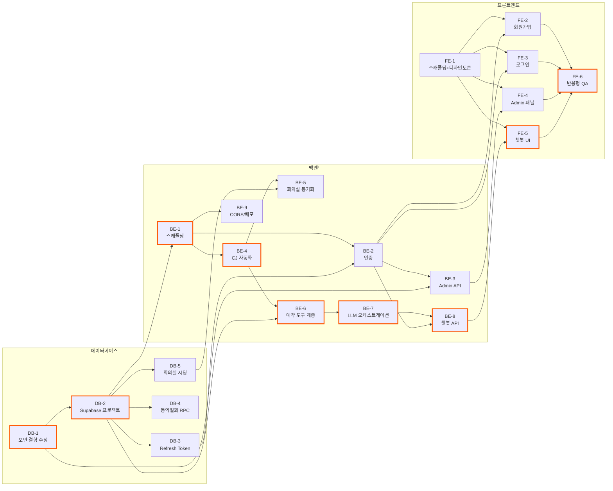

# 실행계획 — 회의실 예약 Agent

`docs/`, `prompts/`, `supabase/`에 정리된 확정 사항(도메인 정의서, PRD, ERD, 프로젝트 구조 원칙, 통합 스키마, 보안 검토 결과)을 근거로 DB/백엔드/프론트엔드 단위 Task로 분해한 실행계획이다. 각 Task는 작업 내용·선행 Task·체크박스형 완료 조건으로 구성된다.

**전체 진행 순서 요약**: `DB-1`(보안 결함 수정)이 다른 모든 인증 관련 작업의 전제 조건이므로 최우선. 그다음 `DB-2`(실제 Supabase 프로젝트 생성)가 백엔드/프론트 개발 착수의 공통 전제. 이후 DB→백엔드→프론트 순으로 대체로 진행되지만, 화면(프론트) 스캐폴딩과 디자인 토큰 반영(`FE-1`)은 백엔드와 병행 가능하다.

## 전체 Task 의존관계

색이 칠해진 노드(진한 테두리)는 크리티컬 패스(가장 긴 연쇄, 전체 일정을 좌우하는 경로)다.

---

## 데이터베이스 (DB)

### DB-1. 보안 결함 긴급 수정 — SECURITY DEFINER 함수 권한 회수 + 화이트리스트 재검증

- **작업 내용**: `security-reviewer` 검토에서 발견된 치명적 결함(anon key로 `approve_account_registration_request` 등을 직접 호출해 Admin 권한을 탈취할 수 있는 문제)을 고치는 새 마이그레이션 파일을 `supabase/migrations/`에 추가한다.
  - `approve_account_registration_request`, `reject_account_registration_request`, `get_user_frequent_rooms` 세 함수에 `revoke execute on function ... from public, anon, authenticated;` 추가
  - `approve_account_registration_request`가 호출자가 넘긴 `p_is_auto`를 그대로 신뢰하지 않고, 함수 내부에서 `admin_whitelist`를 직접 재조회해 `is_admin` 여부를 결정하도록 로직 수정
  - `supabase/8-schema.sql`(통합본)에도 동일하게 반영
- **선행 Task**: 없음 (다른 모든 인증 관련 Task의 선행 조건)
- **완료 조건**:
  - [x] 새 마이그레이션 파일이 `supabase/migrations/`에 타임스탬프 순으로 추가됨 (`20260813001200_fix_admin_escalation.sql`)
  - [x] 세 함수 모두 `REVOKE EXECUTE ... FROM public, anon, authenticated` 적용 확인
  - [x] `approve_account_registration_request`가 `admin_whitelist`를 직접 재조회하도록 수정되고, 호출자 입력값(`p_is_auto`)만으로 Admin이 부여되지 않음을 코드로 확인 (`p_is_auto` 파라미터 자체를 제거, 수동 승인 시 `p_admin_user_id`가 실제 활성 Admin인지도 DB가 검증)
  - [x] `supabase/8-schema.sql`이 이 수정 사항까지 반영해 최신화됨
  - [ ] 로컬/스테이징 Supabase 프로젝트에 적용 후, anon key로 세 함수를 직접 RPC 호출 시 권한 오류로 거부되는지 실제 테스트로 확인 (아직 실제 프로젝트 없음 — DB-2 완료 후 진행)

### DB-2. 실제 Supabase 프로젝트 생성 및 마이그레이션 적용

- **작업 내용**: supabase.com에 프로젝트 생성(Dev/Prd 공용, PRD 결정사항), `supabase/migrations/` 전체를 순서대로 적용, `.env`의 `SUPABASE_URL`/`SUPABASE_SERVICE_ROLE_KEY`/`SUPABASE_ANON_KEY`/`DATABASE_URL`(커넥션 풀러 6543 포트) 채움.
- **선행 Task**: DB-1
- **완료 조건**:
  - [ ] Supabase 프로젝트 생성 완료
  - [ ] `supabase/migrations/` 전체(DB-1 포함)가 순서대로 적용되어 오류 없이 끝까지 실행됨
  - [ ] `.env`의 Supabase/DB 관련 값이 실제 프로젝트 값으로 채워짐 (커넥션 풀러 주소 사용, 5432 직접 연결 아님)
  - [ ] `psql` 또는 Supabase 대시보드에서 8개 테이블이 모두 생성된 것을 확인

### DB-3. Refresh Token 폐기 테이블 추가

- **작업 내용**: PRD "인증/보안" 절에서 결정된 대로, Refresh Token 발급 이력을 저장해 서버가 개별/전체 폐기(revoke)할 수 있는 테이블(`refresh_tokens` 등)을 설계·추가하는 마이그레이션 작성. `security-reviewer` 권고대로 `users.password_changed_at`(또는 동등한 컬럼) 추가도 함께 검토.
- **선행 Task**: DB-2
- **완료 조건**:
  - [x] `refresh_tokens` 테이블(또는 동등 설계)이 마이그레이션으로 추가됨 (`20260813002000_refresh_tokens.sql`) — 최소 컬럼: 토큰 식별자/해시, `user_id` FK, 발급/만료 시각, 폐기 여부·시각. 로컬 개발 DB(`DB-2` 미완료로 클라우드 Supabase 대신 로컬 Postgres 사용 중)에 실제 적용 확인 완료
  - [x] 개별 토큰 폐기(로그아웃)와 사용자 전체 토큰 폐기(비밀번호 변경/보안사고 대응) 두 시나리오 모두 쿼리로 처리 가능한 구조인지 확인 (`(user_id, revoked)` 인덱스, 별도 RPC 불필요)
  - [x] `supabase/8-schema.sql`에도 반영 (`prompts/8-erd.md`도 함께 갱신)

### DB-4. 동의 철회 시 자격증명 즉시 폐기 RPC 추가

- **작업 내용**: 도메인 정의서 8번 "동의 철회 시 즉시 삭제 및 접근 차단" 요구사항을 DB 레벨에서 강제하는 RPC(`revoke_user` 등) 추가. `users.status='revoked'` 전환과 동시에 `encrypted_password`/`app_password_hash`를 원자적으로 비운다.
- **선행 Task**: DB-2
- **완료 조건**:
  - [ ] `revoke_user(user_id)` 형태의 함수가 마이그레이션으로 추가됨
  - [ ] 함수 실행 시 `status='revoked'`, `revoked_at=now()`, `encrypted_password=''`, `app_password_hash=null`이 하나의 트랜잭션으로 처리됨
  - [ ] `check (status <> 'revoked' or revoked_at is not null)` 등 정합성 제약 추가
  - [ ] `supabase/8-schema.sql`에도 반영

### DB-5. 회의실 마스터데이터 시딩

- **작업 내용**: `rooms` 테이블에 상암S시티 3F·12F~16F 실제 회의실 데이터(room_code, area_code, sub_area_code, room_name, floor_label)를 입력. `capacity`는 CJ API의 `room_info.ATTENDER_LIMIT` 파싱 결과로 채우는 것이 원칙이나(도메인 정의서 9번), 최초 시딩은 수동 스크립트로 진행 가능.
- **선행 Task**: DB-2, (capacity 자동 채움은 BE-4·BE-5 완료 후 재실행 권장)
- **완료 조건**:
  - [x] 3F, 12F~16F 각 층의 실제 회의실이 `rooms`에 모두 입력됨 (`backend/scripts/seed-rooms.ts` 실행, 로컬 개발 DB 기준. 실측 결과 3F는 11개(3F-8 없음), 12F 4개, 13F 4개, 14F 4개(14F-1 없음), 15F 2개(15F-4~5만 존재), 16F 1개로 도메인 문서 예시 "3F-1~3F-12"와 실제 회의실 개수가 다름을 확인 — 실사용 조회 결과를 그대로 반영했으며 도메인 정의서 9번에도 반영함)
  - [x] B1F/2F는 데이터에 아예 포함하지 않음 (스캔 대상 층 목록에서 처음부터 제외)
  - [x] 각 회의실의 `room_code`/`area_code`/`sub_area_code`가 실제 CJ 시스템 값과 일치함 (스캔 결과 그대로 upsert, SELECT로 NULL/이상값 없음 확인)
  - [x] `capacity`가 26개 회의실 전부 실제 값(응답 HTML의 `num_person` 파싱, 추정치 아님)으로 채워짐

---

## 백엔드 (Backend)

### BE-1. 백엔드 프로젝트 스캐폴딩

- **작업 내용**: `5-project-principle.md` 7번 구조대로 Node.js + Express + TypeScript 프로젝트 초기화. `orchestration/ tools/ cj-automation/ services/ security/ db/ middleware/ config/` 폴더 생성, `pg` 커넥션 풀(풀러 6543 사용) 연결, `.env` 파싱 모듈(`config/env.ts`) 작성, Vercel Functions 진입점(`api/`) 구성.
- **선행 Task**: DB-2
- **완료 조건**:
  - [x] `5-project-principle.md` 7번의 폴더 구조가 그대로 생성됨
  - [x] `pg` Pool이 `DATABASE_URL`로 연결되고, 로컬에서 간단한 쿼리(`select now()`)가 성공함 (DB-2 미완료로 지금은 커넥션 풀러 6543 대신 로컬 Postgres 5432로 대체 — 나중에 `.env`만 교체하면 됨, 코드에 포트/호스트 가정 없음)
  - [x] `.env`의 시크릿(JWT 두 키, `CREDENTIAL_ENCRYPTION_KEY`, `OPENAI_API_KEY`)이 서로 다른 변수로 분리 로딩됨을 확인
  - [ ] Vercel Functions로 배포했을 때 헬스체크 엔드포인트(`GET /api/health`)가 정상 응답 (아직 미배포 — 로컬 `GET /health` 정상 응답까지만 확인함)

### BE-2. 인증 모듈 (회원가입 / 로그인 / JWT)

- **작업 내용**: `security/corporatePassword.ts`(암호화/복호화), `security/appPassword.ts`(해시/검증), `authService.ts`(JWT 발급·재발급·폐기), `routes/auth.routes.ts`, `routes/registration.routes.ts` 구현. Access Token은 짧은 만료로 응답 바디에, Refresh Token은 httpOnly+Secure+SameSite 쿠키로 발급.
- **선행 Task**: BE-1, DB-3
- **완료 조건**:
  - [x] 회원가입 API가 사내 계정 비밀번호는 암호화, 앱 로그인 비밀번호는 해시로 각각 다른 모듈을 통해 저장함 (두 로직이 물리적으로 다른 파일에 있음)
  - [x] 화이트리스트 매칭 시 자동승인, 아니면 pending으로 접수되는 흐름이 DB-1의 안전한 함수 호출 경로로 동작함
  - [x] 로그인 성공 시 Access Token(응답 바디) + Refresh Token(httpOnly 쿠키) 둘 다 발급됨
  - [x] Access Token 만료 후 재발급 엔드포인트가 Refresh Token으로 정상 동작함
  - [x] 로그아웃 시 DB-3의 폐기 테이블에 해당 Refresh Token이 무효 처리됨
  - [x] 승인 대기/거부/자격증명 오류 각각의 로그인 실패 상태 메시지가 올바르게 구분되어 반환됨 (curl 시나리오 5단계로 로컬 검증 완료)

  **[2026-08-14 FE-2 착수 전 보강]** 회원가입이 `preferred_room_ids`(선호 회의실 우선순위 배열)를 받지 않던 누락을 발견해 채움: 마이그레이션(`20260814000000_registration_preferred_rooms.sql`)으로 `account_registration_requests.preferred_room_ids uuid[]` 추가, `registrationService`/`adminService`가 자동승인·수동승인 양쪽 경로 모두에서 승인 시점에 `user_preferred_rooms`로 옮겨 심도록 구현(`userPreferredRoomRepository.setPreferredRooms`). 공개 `GET /rooms`(+`GET /rooms/:id`) 엔드포인트도 이번에 신규 추가(`routes/rooms.routes.ts`, `docs/swagger.json`에는 이미 명세돼 있었음) — `min_capacity`/`floor_label` 필터만 지원, swagger가 명세한 `date`+`start_time`+`end_time` 실시간 가용성 결합은 **범위 밖으로 명시적으로 보류**(익명 사용자가 어느 CJ 계정으로 조회할지 미결정이라 `date` 파라미터 전달 시 400으로 명확히 거부). curl로 회원가입(pending/auto_approved 양쪽)→`user_preferred_rooms` 우선순위 저장까지 실측 검증 완료.

### BE-3. Admin 승인 API

- **작업 내용**: `routes/admin.routes.ts`, `adminService.ts` — 대기중 등록 요청 목록 조회, 승인/거부 처리(DB-1의 안전한 RPC 호출), Admin 권한 검증 미들웨어(`requireAdmin`).
- **선행 Task**: BE-2, DB-1
- **완료 조건**:
  - [x] `GET /admin/registration-requests`가 pending 목록을 반환 (비밀번호/암호문은 응답에 절대 포함 안 됨)
  - [x] 승인/거부 API가 DB-1에서 수정된 RPC를 정상 호출하고, 결과가 `account_registration_requests`/`users`에 반영됨
  - [x] `is_admin=false`인 사용자의 토큰으로 호출 시 403 반환
  - [x] 승인/거부 후 목록에서 해당 항목이 사라지고 처리 이력에 반영됨 (curl 6단계 시나리오로 로컬 검증 완료)

  **[2026-08-14 FE-4 착수 전 보강]** `GET /admin/registration-requests`가 `status` 쿼리 파라미터를 지원하도록 확장(`docs/swagger.json`에는 이미 명세돼 있었으나 구현이 안 되어 있었음): 생략 시 pending, `status=processed`는 auto_approved/approved/rejected 3종을 처리 시각 최신순으로 묶어 반환(FE-4 "처리 완료 이력", 최근 50건 제한). 응답에 `processed_by_email_alias`(처리자 표시용, 자동승인 시 null → 프론트가 "system"으로 표시)와 `preferred_room_ids`도 추가. curl로 pending/processed/잘못된 status(400) 전부 실측 검증.

### BE-4. CJ 자동화 계층

- **작업 내용**: `cj-automation/session.ts`(Playwright 로그인, 세션 유효성 확인+재로그인), `cj-automation/client.ts`(9번 API 명세의 각 엔드포인트 래퍼), `cj-automation/availabilityParser.ts`(`reserve_all_list` + `event_list` 겹침 판정 알고리즘). Vercel Functions 위에서 `@sparticuz/chromium` 사용.
- **선행 Task**: BE-1
- **완료 조건**:
  - [x] 사내 계정 암호화 자격증명을 복호화해 Playwright로 실제 로그인에 성공함 (이 계층 밖으로 복호화된 비밀번호가 전달되지 않음). 실제 흐름(**2026-08-13 BE-7 라이브 검증 중 재확인해 수정**): `cj.cj.net`(`/PT/login.aspx`, `#txtID`/`#txtPWD`)에서 로그인 → 포털 메인(`23_main.aspx`) 로딩 대기 → **회의실예약 버튼(`button#bntConf`, `onclick="select_menu('EPCT3427','LSB')"`) 클릭**(← `23_service.aspx?CONTENTS_ID=EPCT3427`로 직접 `page.goto`하면 `net::ERR_ABORTED`로 실패함을 재검증. 이 URL은 실서버 페이지가 아니라 클라이언트 사이드 콘텐츠 스왑용) → `cjwappr.cj.net`으로 SSO 핸드셰이크(`/NConf/Anonymity/nconfFilter.aspx`)해 API용 쿠키(`AP`) 획득(클릭 후 1초 내) → 이 쿠키로 순수 HTTP ASMX 호출 가능. 도메인 정의서 §8/§9에 "Azure AD" 오기 정정 및 실제 로그인 흐름 반영 완료
  - [x] `getDayPilotConfReserveList`, `checkRoom`, `checkStraightRoom`, `checkDayCountLimit`, `SaveReserve`, `delReserve`, `getConfReservationInfo`, `bindMyReservation` 전부 래핑됨 (경로 접두사 `NCONF/Common/WebService/` 누락 버그 수정, EUC-KR→UTF-8 인코딩 오판 정정, 서버 응답 이어붙임 현상 방어 로직 추가)
  - [x] 가용성 판단 알고리즘(그리드 AND event_list)이 도메인 정의서 9번에 정리된 실사용 케이스(8/13 스캔 결과)와 동일한 결과를 냄 — fixture 기반 유닛 테스트(vitest 25개) 통과로 검증. **단, 이 fixture는 실측 원본 바이트가 아니라 서술을 재구성한 것이었고, BE-7 라이브 검증에서 실제 CJ 원본 응답 형식(`reserve_all_list`가 파이프 구분 문자열, `event_list.start/end`가 전체 ISO 타임스탬프)과 다르다는 게 뒤늦게 드러나 `tools/availability.tool.ts`에서 파싱 버그를 수정함(BE-7 절 참고) — 알고리즘 자체(`availabilityParser.ts`)는 문제 없었고, CJ 원본→정규화 변환 단계의 버그였음**
  - [x] Vercel Functions 환경(콜드스타트, 300초 제한 이내)에서 로그인+API 호출 1건이 실제로 성공함 → 로컬 환경에서 실제 로그인+`getDayPilotConfReserveList`/`bindMyReservation` 호출 성공으로 대체 검증 (실제 Vercel 배포 테스트는 별도 스코프)

### BE-5. 회의실 마스터데이터 동기화

- **작업 내용**: `getDayPilotConfReserveList` 응답의 `room_info`(`ATTENDER_LIMIT` 등)를 파싱해 `rooms.capacity`를 채우거나 갱신하는 동기화 로직/스크립트 작성.
- **선행 Task**: BE-4, DB-5
- **완료 조건**:
  - [x] 전체 층(3F, 12F~16F) 스캔 후 `rooms.capacity`가 실제 값으로 갱신됨 (`backend/src/services/roomSyncService.ts`의 `syncRoomMasterData(userId)`를 로컬 DB `jiil` 계정으로 실행해 26개 회의실 전부 스캔 확인, `backend/scripts/seed-rooms.ts`는 이 서비스를 호출하는 얇은 CLI 래퍼로 리팩터링)
  - [x] 재실행해도 기존 값과 다를 때만 갱신되는 멱등적 동작 확인 (upsert) — `roomRepository.upsertRoomIfChanged`가 `is distinct from` 조건으로 실제 변경 없으면 UPDATE 자체를 건너뛴다. 실측: 변경 없는 상태에서 연속 재실행 시 "0개 변경"·`updated_at` 불변 확인, 의도적으로 한 방(`room_code=4539`)의 `capacity`를 999로 변조 후 재실행하니 그 방만 "1개 변경"으로 감지되어 실제 값(8)으로 복구되고 다른 25개 방의 `updated_at`은 그대로였음을 확인

### BE-6. 예약 도구(tools) 계층

- **작업 내용**: `tools/availability.tool.ts`(가용성 조회+선호회의실 우선순위+조건검색+이력기반추천), `tools/reservation.tool.ts`(예약 생성, 긴 회의 분할+보상 트랜잭션 포함), `tools/modifyReservation.tool.ts`, `tools/cancelReservation.tool.ts`, `tools/myReservations.tool.ts`. `checkRoom → checkStraightRoom → checkDayCountLimit → SaveReserve` 순서 강제.
- **선행 Task**: BE-4, DB-2
- **완료 조건**:
  - [x] 도메인 정의서 2번의 9개 유스케이스(해피패스/조건검색/이력추천/긴회의분할/내예약조회/변경/취소/온보딩 제외)가 각각 함수로 구현됨 (`backend/src/tools/` — `availability.tool.ts`, `reservation.tool.ts`, `modifyReservation.tool.ts`, `cancelReservation.tool.ts`, `myReservations.tool.ts`)
  - [x] 2시간 초과 요청 시 세그먼트 분할(30분 단위, ceil(분/120)) 유닛 테스트 통과 — 분할 규칙은 "앞쪽 세그먼트부터 최대 120분씩 채우고 남는 시간을 마지막에 배정"으로 확정(도메인 정의서 2번 문구도 동일하게 수정: 3시간=180분→120+60분). `npx vitest run` 56개 전부 통과
  - [x] 분할 예약 중 일부 실패 시 이미 생성된 예약이 `delReserve`로 자동 취소되는 보상 트랜잭션 테스트 통과 (`reservation.tool.test.ts`, CJ 저장 실패/DB 저장 실패 두 케이스 모두 검증)
  - [x] 예약 변경/취소는 대상이 모호할 때(여러 건) 바로 진행하지 않고 명확한 오류/안내를 반환함 (`reservationTargeting.ts`의 `AmbiguousReservationTargetError`, 분할그룹 취소 범위 미지정 시 `SplitGroupCancelScopeRequiredError`)
  - [x] `reservations_no_overlap` EXCLUDE 제약 위반 시 서버가 이를 "이미 예약됨" 사용자 메시지로 정상 변환함 (`reservationRepository.ts`, SQLSTATE `23P01` → `RoomAlreadyBookedError`)

  **후속 확인 필요 사항** (실사용 전 CJ 실제 API 응답으로 재검증 필요, 코드 주석에도 남김):
  - `checkRoom`/`checkStraightRoom`/`checkDayCountLimit`/`SaveReserve`의 실제 성공/실패 응답 스키마가 미확인이라 보수적으로 해석하는 헬퍼로 구현함
  - 예약 변경은 "delReserve 후 SaveReserve 재생성" 전략으로 구현(도메인 정의서 8번에 명시된 미확인 사항). 분할 예약(긴 회의) 건의 변경은 이번 범위에서 미지원으로 명시적으로 막음(취소는 지원)
  - `SaveReserve`에 필요한 `phoneNum`은 현재 `users` 테이블에 저장 컬럼이 없어 호출자가 매번 넘기는 파라미터로 처리 — DB 컬럼 추가 필요 여부는 추후 검토

### BE-7. LLM 오케스트레이션 계층

- **작업 내용**: `orchestration/systemPrompt.ts`(비즈니스 규칙 + "요청 처리 가능 여부 판단" 원칙 반영), `orchestration/toolSchemas.ts`(OpenAI tool-calling 스키마), `orchestration/orchestrator.ts`(대화 루프, 세션 상태 관리). 모델은 `OPENAI_MODEL` 환경변수(`gpt-5-nano` 기본).
- **선행 Task**: BE-6
- **완료 조건**:
  - [x] 시스템 프롬프트에 운영시간/2시간 제한/7일 범위/상암S시티 고정/반복예약 미지원 등이 명시됨 (`orchestration/systemPrompt.ts`, `systemPrompt.test.ts`로 문구 존재 검증)
  - [x] "요청 처리 가능 여부 판단" 원칙이 프롬프트 최상위(0번 섹션)에 반영되어, 범위 밖 요청에 임의 실행을 시도하지 않고 안내/되묻기로 응답함 — 실제 OpenAI API로 "매주 월요일 반복 예약해줘" 시나리오를 라이브 검증: 도구를 전혀 호출하지 않고 미지원 안내 후 대안(단일 예약)을 되물음
  - [x] LLM이 BE-6의 도구만 호출하고 CJ 시스템/DB에 직접 접근하지 않음 — `orchestrator.ts`가 `../tools/*`만 import(코드 검토로 확인), `db/*`·`cj-automation/*` import 없음
  - [x] 예약 확정(SaveReserve) 직전 사용자 명시적 확인 없이는 실행되지 않음 — `propose_*`(부작용 없음, confirmationToken 발급) / `confirm_*`(직전 턴 토큰만 실행) 2단계로 코드 레벨 강제, 같은 턴 confirm은 구조적으로 거부. 실제 OpenAI API 라이브 테스트로 `propose_create_reservation`이 실제 토큰을 발급하고 "네, 진행합니다" 같은 명시적 재확인 없이는 멈추는 것까지 확인(confirm은 실제 CJ 예약이 생기므로 의도적으로 실행하지 않음)
  - [x] 세션 상태(진행 중인 예약 등)가 대화록 텍스트가 아니라 서버 상태로 관리됨 (`orchestration/sessionStore.ts`의 `pendingConfirmation`/`turnIndex`, `sessionStore.test.ts`)

  **BE-7 검증 중 발견해 함께 고친 버그** (BE-4/BE-6 범위지만 BE-7 라이브 테스트로만 드러남):
  - `cj-automation/session.ts`: `23_service.aspx?CONTENTS_ID=EPCT3427`로 직접 `page.goto`하면 `net::ERR_ABORTED`로 실패함을 재검증 — 포털 메인(`23_main.aspx`) 로딩 후 회의실예약 버튼(`#bntConf`) 클릭 방식으로 수정(파일 상단 주석에 상세 기록)
  - `tools/availability.tool.ts`: CJ의 `reserve_all_list`가 JSON 배열이 아니라 `"룸코드:슬롯|룸코드:슬롯|..."` 파이프 구분 문자열이었는데 `Array.isArray` 체크로 항상 빈 배열 처리되어 **모든 회의실이 상시 "불가"로 판정되는 치명적 버그**였음. `event_list`의 `start`/`end`도 `"HH:mm"`이 아니라 전체 ISO 타임스탬프였음. 둘 다 파싱 함수 추가로 수정, `availability.tool.test.ts` 신규 추가(6개 테스트)로 회귀 방지

### BE-8. 챗봇 API 엔드포인트

- **작업 내용**: `routes/chat.routes.ts` — `POST /chat/messages`, 로그인 세션(Access Token) 검증, BE-7 오케스트레이터 호출, 응답 반환.
- **선행 Task**: BE-7, BE-2
- **완료 조건**:
  - [x] 미로그인 요청은 401로 거부됨 (`requireAuth` 미들웨어, curl로 Authorization 헤더 없이 호출 시 `401 UNAUTHORIZED` 실측 확인)
  - [x] 로그인된 사용자의 메시지가 오케스트레이터를 거쳐 도구 호출 결과까지 포함한 응답으로 반환됨 (유효 Access Token으로 curl 호출 → `200`, BE-7에서 검증된 것과 일치하는 오케스트레이터 응답 실측 확인)
  - [x] 콜드스타트로 응답이 지연될 수 있는 구간에 대해 클라이언트가 처리 중 상태를 표시할 수 있는 응답 구조 제공 — SSE/스트리밍은 오버엔지니어링으로 판단해 도입하지 않음(판단 근거는 `chat.routes.ts` 상단 주석). 대신 응답에 `elapsed_ms` 필드 포함 + 120초 서버측 타임아웃(초과 시 `504 CHAT_TIMEOUT`)으로 대체

### BE-9. CORS 및 배포 보안 설정

- **작업 내용**: `5-project-principle.md` 5번의 CORS 원칙(허용 origin 환경변수화, 와일드카드 금지, same-origin 배포 우선) 적용. Vercel `vercel.json`에 프론트/백엔드 same-origin 라우팅(`/api/*` rewrite) 구성.
- **선행 Task**: BE-1
- **완료 조건**:
  - [x] `ALLOWED_ORIGINS` 환경변수로 CORS 허용 목록이 관리되고 코드에 도메인이 하드코딩되지 않음 (BE-1에서 이미 구현됨, `.env.example`에 문서화 보완). curl로 허용 origin은 `Access-Control-Allow-Origin` 헤더 포함, 비허용 origin은 헤더 없음(브라우저 차단)을 실측 확인
  - [x] Dev 환경에서 프론트(Vite) → 백엔드 프록시 — **부분 완료**: FE-1이 아직 시작 전이라 실제 `vite.config.ts`는 만들지 않음(스코프 침범 방지). FE-1에서 바로 쓸 수 있는 `server.proxy` 설정을 문서화해둠. **FE-1 착수 시 결정 필요**: 백엔드 라우트가 현재 `/auth`,`/admin`,`/chat`로 루트 마운트되어 있어, 프록시 경로를 개별 지정하거나 백엔드를 `/api/*`로 리네이밍할지 택1 필요
  - [x] Prd 배포에서 프론트/백엔드 same-origin 또는 CORS 화이트리스트 — **부분 완료**: `backend/vercel.json` 신규 생성(Hobby 300초 `maxDuration` 반영, 백엔드 단독 배포 시 사용). 프론트/백엔드 통합 rewrite(`/api/*`)는 프론트 디렉터리 구조가 없는 상태라 추측성 설정을 피하기 위해 FE-1 이후로 의도적으로 보류(파일 내 주석에 근거 명시). 분리 배포 시엔 위 `ALLOWED_ORIGINS` 화이트리스트로 대응 가능
  - [x] `Secure` 쿠키 플래그가 `NODE_ENV` 기준으로 정확히 토글됨 (BE-2에서 이미 구현됨, `auth.routes.ts`의 `refreshTokenCookieOptions()`가 `secure: config.isProd`로 분기하는 것을 코드 레벨로 재확인)

  **후속 확인 필요 사항**: FE-1 스캐폴딩 시 (1) Vite 프록시 경로 vs 백엔드 라우트 프리픽스 정합성 결정, (2) 프론트/백엔드를 같은 Vercel 프로젝트로 묶을지 분리 배포할지 확정 후 루트 `vercel.json` 작성 필요

---

## 프론트엔드 (Frontend)

### FE-1. 프론트엔드 프로젝트 스캐폴딩 + 디자인 토큰 반영

- **작업 내용**: `5-project-principle.md` 6번 구조대로 React 19 + Zustand + TanStack Query 프로젝트 초기화. `DESIGN.md`(Intercom 기반) 토큰을 CSS 변수/테마 시스템으로 정리하고, 공용 `components/`(버튼, 인풋, 카드, 칩 등)를 `docs/design/chatbot-shell.html`에서 구현된 스타일 그대로 컴포넌트화.
- **선행 Task**: 없음 (백엔드와 병행 가능)
- **완료 조건**:
  - [x] `5-project-principle.md` 6번의 폴더 구조(`pages/ components/ stores/ queries/ api/ routes/ types/`)가 그대로 생성됨 (`frontend/src/`, React 19 + Zustand + TanStack Query + React Router 설치 확인)
  - [x] `DESIGN.md`의 색상/타이포/radius/spacing 토큰이 CSS 변수로 정의되고 라이트/다크 테마 모두 지원됨 (`frontend/src/styles/tokens.css`, Playwright 스크린샷으로 라이트/다크 렌더링 확인). 다크 테마는 `DESIGN.md`가 공식 문서화하지 않았던 부분이라 기존 `inverse-*` 토큰을 재사용해 구성했고, 파생된 신규 토큰 5개(`inverse-surface-2`, `inverse-ink-subtle`, `inverse-ink-tertiary`, `inverse-hairline`(-soft), `semantic-*-soft`)는 검토 후 `DESIGN.md`에 정식 반영함(`## Dark Theme` 절 추가)
  - [x] 버튼(primary/ghost), 입력창, 카드, 칩, 뱃지 공용 컴포넌트가 `docs/design/chatbot-shell.html`과 시각적으로 동일하게 구현됨 (`frontend/src/components/{Button,TextInput,Card,Chip,Badge}`, 8-state 전부 Playwright로 렌더링 검증)
  - [x] `httpClient.ts`가 Access Token 첨부 + 401 시 재발급 흐름을 처리함 (`frontend/src/api/httpClient.ts`) — 유닛 테스트 4개 통과 + 실제 로컬 백엔드로 로그인→만료 토큰→401→refresh→재시도→실제 챗봇 응답까지 end-to-end 라이브 검증 완료

  **참고**: Vite dev 프록시는 백엔드 라우트(`/auth`,`/admin`,`/chat`)를 리네이밍하지 않고 개별 경로로 매핑(BE-9에서 남겨둔 결정사항 해소). `queries/`, `stores/`의 화면별 파일(`authQueries.ts` 등)은 FE-2~5에서 해당 화면 작업 시 추가 예정(오버엔지니어링 방지로 이번엔 빈 스텁 생성 안 함).

### FE-2. 회원가입 페이지

- **작업 내용**: `7-wireframes.md` 1번 와이어프레임 기준. 사내 계정 ID/PW, 선호 회의실 우선순위(추가/삭제), 앱 로그인 비밀번호+확인 폼. 데스크톱/모바일(≤860px) 레이아웃 모두 구현.
- **선행 Task**: FE-1, BE-2(회원가입 API)
- **완료 조건**:
  - [x] 와이어프레임의 모든 입력 필드가 구현되고, 두 비밀번호(사내계정/앱로그인) 입력란이 명확히 구분 표기됨 (`RegisterPage.tsx`, 각 필드에 helpText로 용도 구분 문구 표시). 실제 브라우저(Playwright)로 렌더링 확인
  - [x] 선호 회의실 추가/삭제가 동작하고 `rooms` 목록을 anon 공개 조회로 가져옴 (`PreferredRoomPicker.tsx` + `useRoomsQuery`) — 실제 브라우저에서 [+ 추가] 클릭 시 실제 26개 회의실이 드롭다운에 뜨는 것까지 실측 확인. 와이어프레임은 행별 개별 삭제 버튼이지만, 이 구현은 "맨 뒤에 추가/맨 뒤 삭제" 방식으로 단순화(우선순위 추가·삭제·비워두기 기능은 동일하게 충족, 오버엔지니어링 방지 목적 — 코드 주석에 근거 명시)
  - [x] 제출 후 접수 확인 화면(자동승인/관리자승인 분기 안내)이 표시됨 — pending 분기는 실제 브라우저로 end-to-end 실측(제출 → "관리자 승인 후 이용" 안내 화면). auto_approved 분기는 동일 컴포넌트의 삼항 조건 코드 검토 + 오늘 백엔드 보강 작업 때 이미 실측한 `status: "auto_approved"` 응답 형태로 교차 확인(별도 화이트리스트 계정 재검증은 생략)
  - [x] 860px 이하에서 와이어프레임의 모바일 레이아웃(1컬럼)으로 전환됨 — 390px 뷰포트 스크린샷으로 전체폭 필드/버튼 1컬럼 배치 실측 확인
  - [x] 제출 실패(중복 ID 등) 시 에러 메시지가 명확히 표시됨 — 동일 ID로 재제출 시 "이미 등록되었거나 처리 대기 중인 사내 계정 ID입니다." alert 표시를 실제 브라우저로 확인

  **참고**: 이 과정에서 회원가입/`GET /rooms` 백엔드 보강(BE-2 절 참고)도 함께 실사용 검증됨. 테스트 계정(`fe2.playwright.test`)은 검증 후 DB에서 삭제, 띄운 백엔드/프론트 dev 서버 모두 종료함.

### FE-3. 로그인 페이지

- **작업 내용**: `7-wireframes.md` 2번 기준. 사내 계정 ID + 앱 로그인 비밀번호 입력, 로그인 성공 시 세션 저장 후 챗봇 UI(또는 Admin 권한이면 Admin 패널)로 리다이렉트.
- **선행 Task**: FE-1, BE-2
- **완료 조건**:
  - [x] 로그인 성공 시 Access Token이 Zustand 스토어(메모리)에만 저장되고 `localStorage`에 저장되지 않음 (`LoginPage.tsx`가 FE-1의 `authStore.setSession`만 사용) — 실제 브라우저에서 로그인 후 `localStorage.length === 0`으로 실측 확인
  - [x] 승인 대기/거부/자격증명 오류 상태 메시지가 각각 구분되어 표시됨 (`error.code`로 분기, 와이어프레임 문구 그대로 재현) — 테스트 계정 4개(자동승인/수동승인/pending/rejected)로 실제 브라우저에서 3가지 실패 상태 + 정상 로그인까지 전부 실측 확인
  - [x] Admin 권한 사용자는 Admin 패널로, 일반 사용자는 챗봇 UI로 정확히 라우팅됨 — 실제 브라우저에서 admin 계정 로그인 시 `/admin`, 일반 계정 로그인 시 `/chat`으로 리다이렉트되는 것까지 실측 확인. 테스트 계정은 모두 DB에서 정리, 백엔드/프론트 dev 서버 모두 종료함

### FE-4. Admin 승인 패널

- **작업 내용**: `7-wireframes.md` 3번 기준. 대기중 등록 요청 목록(카드), 승인/거부 버튼, 처리 완료 이력. 모바일에서는 이력 기본 접힘.
- **선행 Task**: FE-1, BE-3
- **완료 조건**:
  - [x] 대기중 목록이 실시간(또는 재조회)으로 표시되고 승인/거부 처리 후 목록에서 사라짐 — TanStack Query, 승인/거부 성공 시 pending·processed 쿼리 모두 invalidate. 실제 브라우저로 승인 1건/거부 1건 처리 → 즉시 목록에서 사라지고 이력 맨 위에 나타나는 것까지 실측 확인
  - [x] 비밀번호/암호문이 어떤 형태로도 화면에 노출되지 않음 — 백엔드 응답 자체에 비밀번호 필드가 없고(구조적으로 불가능), 프론트도 이름을 명시한 필드만 렌더링
  - [x] Admin 권한이 없는 사용자가 접근 시 이 화면으로 진입할 수 없음 (`RequireAdmin` 라우팅 가드, `routes/RequireAdmin.tsx`) — 실제 브라우저로 3가지 케이스 전부 실측: 미로그인 시 `/login`, 로그인했지만 non-admin이면 `/chat`, admin이면 정상 진입
  - [x] 860px 이하에서 처리 완료 이력이 기본 접힘 상태로 렌더링됨(`
`, 데스크톱은 별도 섹션으로 항상 펼침) — 390px 스크린샷으로 실측 확인

  **FE-4 진행 중 발견해 함께 고친 버그 2건**:
  1. `frontend/vite.config.ts`의 dev 프록시가 `/admin`,`/chat` 등 프론트 페이지 라우트와 이름이 겹치는 백엔드 API 경로를 무조건 백엔드로 넘겨서, `/admin`에 직접 접속(새로고침 등)하면 SPA 대신 백엔드의 raw JSON 401 응답이 그대로 노출되던 버그(실측 확인). Vite 공식 문서의 `bypass` 패턴으로 수정: `Accept` 헤더에 `html`이 포함된 요청(브라우저 최상위 내비게이션)은 프록시를 건너뛰고 `index.html`을 서빙해 SPA 라우터가 처리하게 함.
  2. 공용 `Button` 컴포넌트에 `white-space: nowrap`이 없어, 좁은 flex 컨테이너(Admin 헤더의 "로그아웃" 버튼, 390px)에서 버튼 라벨이 글자 단위로 세로 줄바꿈되던 버그(실측 확인, 스크린샷으로 재현·수정 확인). `components/Button.css`에 `white-space: nowrap; flex-shrink: 0;` 추가 — 프로젝트 전역 버튼에 적용되는 근본 수정.

  **[2026-08-14, 사내망 재연결 후 회귀 테스트]** 백엔드 `npx tsc --noEmit`+`vitest`(93개), 프론트 `npm run build`+`vitest`(4개) 전부 재통과 확인. CJ 실시간 연동(BE-4/BE-6/BE-7)도 `findAvailableRooms` 라이브 호출로 재검증(14개 회의실 정상 조회) — 이번 FE-4 작업이 기존 CJ 연동에 영향 없음을 확인.

### FE-5. 웹 챗봇 UI

- **작업 내용**: `7-wireframes.md` 4번 / `docs/design/chatbot-shell.html` 기준. 메시지 스레드, 단일/다중 회의실 제안 카드, 빠른명령 칩, 입력창, 오른쪽 사이드바(오늘예약/선호회의실/규칙안내). BE-8 API와 실제 연동.
- **선행 Task**: FE-1, BE-8
- **완료 조건**:
  - [ ] 사용자 메시지 전송 → 백엔드 응답 → 메시지 스레드에 렌더링되는 전체 흐름이 실제로 동작함
  - [ ] 회의실 제안 카드의 [확정]/[다른 곳 보기] 버튼이 실제 예약 확정/재조회 API를 호출함
  - [ ] 콜드스타트로 응답이 지연되는 구간에 "확인 중입니다" 처리중 표시가 나타남 (서비스 시나리오 10번)
  - [ ] 빠른명령 칩(내 예약 조회/자주 쓰는 회의실/예약 취소)이 각각 대응하는 요청을 전송함
  - [ ] 860px 이하에서 사이드바가 숨겨지고 채팅 컬럼이 전체폭으로 전환됨

### FE-6. 반응형 전체 QA 및 접근성 점검

- **작업 내용**: 4개 화면 전체를 실제 모바일/태블릿 뷰포트에서 점검하고, `7-wireframes.md`에 TBD로 남겨둔 "모바일에서 챗봇 사이드바 정보를 다시 보는 방법"을 확정해 구현.
- **선행 Task**: FE-2, FE-3, FE-4, FE-5
- **완료 조건**:
  - [ ] 4개 화면이 실제 모바일 기기(또는 브라우저 반응형 모드) 860px/480px 구간에서 모두 정상 동작
  - [ ] 모바일에서 숨겨진 챗봇 사이드바 정보(오늘예약/선호회의실/규칙)에 접근할 수 있는 대체 UI가 구현됨
  - [ ] 키보드 포커스 상태(`:focus-visible`)가 모든 인터랙션 요소에서 시각적으로 확인됨
  - [ ] 로그인~예약 1건 확정까지의 골든 패스를 모바일 뷰포트에서 수동으로 완주 확인
